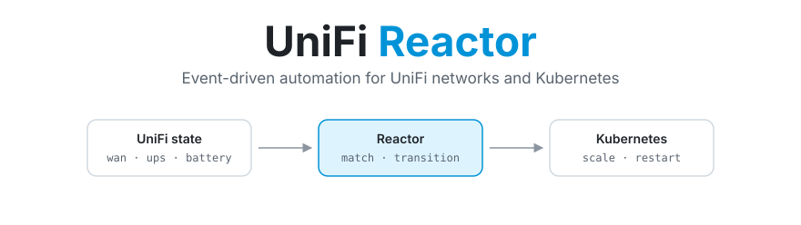
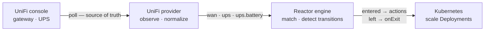

<picture>
  <source media="(prefers-color-scheme: dark)" srcset=".github/assets/banner-dark.svg">
  
</picture>

<p align="center">
  <a href="https://github.com/robbeverhelst/unifi-reactor/actions/workflows/test.yml"></a>
  <a href="https://github.com/robbeverhelst/unifi-reactor/releases"></a>
  <a href="https://github.com/robbeverhelst/unifi-reactor/pkgs/container/unifi-reactor"></a>
  <a href="LICENSE"></a>
</p>

<p align="center">
  <a href="#quickstart">Quickstart</a> ·
  <a href="#your-first-automation">First automation</a> ·
  <a href="#state-keys">State keys</a> ·
  <a href="#configuration">Configuration</a> ·
  <a href="docs/spec.md">Design spec</a>
</p>

---

Your WAN fails over to the 5G backup at 3am. Nothing in the cluster notices: qBittorrent keeps seeding, the nightly backup starts on schedule, and you find out when the data cap bill arrives. Or the power drops, the UPS starts counting down eighteen minutes of battery, and your cluster spends them transcoding video.

Your UniFi gear already knows all of this. **UniFi Reactor** is a Kubernetes operator that turns what it knows — which WAN is live, whether the UPS is on mains — into declarative actions on your cluster.

## Why this exists

- **State, not events** — Reactor polls the UniFi Network API and reconciles against what it observes. A dropped webhook, a network blip, or a controller restart can't strand your cluster in the wrong mode, because the next observation corrects it. Webhooks are an optimization, never the mechanism of record.
- **Reversal is explicit** — an automation says what to do when a condition starts holding, and separately what it wants once it stops. Nothing is inferred, undoing is never guessed, and every execution is recorded in the resource's status.
- **One workload, many automations** — a target's replica count is arbitrated across every automation pointing at it, not written by whichever one saw a transition last. Two automations can pause the same workload for unrelated reasons, and it stays paused until *neither* wants it down.
- **Safe by default** — a dedicated ServiceAccount with exactly the verbs it needs, no `cluster-admin`, no arbitrary shell execution, and credentials read from Kubernetes Secrets. Actions are desired-state (`replicas = 0`), so retrying one is harmless.
- **Boring to operate** — one static binary in a distroless image, no database, no queue, no UI. Small enough to forget about in a homelab.

## How it works



The engine knows nothing about UniFi. A provider converts vendor-specific reality into normalized state, and the engine reconciles your `Automation` resources against it. That seam is what lets other providers — a UPS over NUT, Proxmox, Prometheus alerts — arrive later without touching the core.

Observing `wan: backup` fifty times in a row does nothing fifty times. Scaling is a **desired state**, not a command: Reactor works out what every automation currently wants for a workload and reconciles it there, so the result depends only on which conditions hold — never on the order they were observed in.

## Quickstart

Create an API key in the UniFi UI under **Settings → Control Plane → Integrations**, then:

```sh
kubectl create namespace reactor-system

kubectl -n reactor-system create secret generic unifi-reactor-credentials \
  --from-literal=UNIFI_API_KEY=<your-api-key>

helm install reactor oci://ghcr.io/robbeverhelst/charts/reactor \
  --namespace reactor-system \
  --set unifi.url=https://192.168.1.1
```

Or without Helm, using the manifest bundle from the latest release:

```sh
kubectl apply -f https://github.com/robbeverhelst/unifi-reactor/releases/latest/download/install.yaml
```

Confirm it can see your hardware:

```sh
kubectl -n reactor-system logs deploy/reactor | grep 'state observed'
# {"state": {"ups":"online","ups.battery":"normal","wan":"primary"}}
```

## Your first automation

Pause downloads while the WAN is on the backup uplink, and resume them when it recovers — one resource covers both directions:

```yaml
apiVersion: reactor.robbeverhelst.com/v1alpha1
kind: Automation
metadata:
  name: pause-downloads-on-backup-wan
  namespace: media
spec:
  when:
    provider: unifi
    state:
      wan: backup

  actions:
    - type: kubernetes.scale
      target: { kind: Deployment, name: qbittorrent }
      replicas: 0

  onExit:
    - type: kubernetes.scale
      target: { kind: Deployment, name: qbittorrent }
      replicas: 1
```

```sh
kubectl -n media get automation
# NAME                           PROVIDER   MATCHING   READY   AGE
# pause-downloads-on-backup-wan  unifi      false      True    12s
```

Shedding load during a power cut is the same shape, matching `ups: on-battery` instead.

## When two automations share a workload

qBittorrent genuinely should pause for *both* a metered uplink and a power cut. Point both automations at it and nothing has to be coordinated by hand:

```sh
kubectl -n media get automation
# NAME                    PROVIDER   MATCHING   APPLIED   AGE
# pause-on-backup-wan     unifi      false      False     3h
# shed-on-battery         unifi      true       True      3h
```

While *any* automation's condition holds, the workload stays at the **most restrictive** replica count asked for. The WAN recovering above does not bring qBittorrent back, because the UPS automation still wants it down — and the automation that lost says so plainly:

```sh
kubectl -n media get automation pause-on-backup-wan -o jsonpath='{.status.targets[0]}'
# {"ref":"Deployment/media/qbittorrent","desired":1,"effective":0,
#  "deferredBy":["media/shed-on-battery"]}
```

The workload comes back only once **no** automation wants it down.

### What "coming back" means

`onExit` declares the value an automation wants once nothing is holding the workload down. Omit it and Reactor restores the **baseline** — what the workload was set to before it first claimed it, recorded on the Deployment itself:

```sh
kubectl -n media get deploy qbittorrent -o jsonpath='{.metadata.annotations}'
# {"reactor.robbeverhelst.com/baseline-replicas":"1",
#  "reactor.robbeverhelst.com/claimed-by":"media/shed-on-battery",
#  "reactor.robbeverhelst.com/claimed-at":"2026-08-13T02:41:07Z"}
```

Those annotations are how a workload explains itself at 3am, and they are removed the moment nothing claims it — after which Reactor asserts nothing and you can scale it by hand freely.

| `spec.reversal` | What the automation wants once nothing claims the target | Default when |
| --- | --- | --- |
| `Declared` | the values in `onExit` | `onExit` is set |
| `Baseline` | whatever the target was before Reactor first claimed it | `onExit` is omitted |
| `None` | nothing — leave it wherever it was left | never; opt in explicitly |

> **Upgrading from v0.3.0:** an automation with no `onExit` used to leave its workload scaled down permanently. It now restores the baseline instead. Set `reversal: None` to keep the old behaviour.

> **GitOps:** Reactor writes `spec.replicas` and the three annotations above onto target Deployments. If Flux or Argo CD manages those Deployments it will report drift and revert them. Exclude the fields on any workload you let Reactor act on — Argo CD `ignoreDifferences` on `/spec/replicas` and the `reactor.robbeverhelst.com` annotations, or a Flux `patch` with the same exclusions.

### Removing an automation, or Reactor itself

Deleting an automation while it is holding a workload down hands the workload back rather than stranding it — a finalizer releases the claim first. Removing the policy removes its effect, even mid-outage, so an automation deleted while the UPS is still on battery brings its workload back up.

`helm uninstall` is the case worth understanding, because Helm does **not** delete the `Automation` CRD or your `Automation` resources. They survive the uninstall and simply stop reconciling. A pre-delete hook therefore releases every claim before the operator goes away, and removes the finalizers, which nothing would be left to service:

```sh
helm uninstall reactor -n reactor-system    # workloads return to their pre-Reactor values
helm uninstall reactor -n reactor-system --no-hooks    # skip it; workloads stay where they are
```

Set `uninstall.releaseClaims: false` to make that skip the default. Either way, every workload keeps its `baseline-replicas` annotation, so what it was before Reactor touched it is always recoverable by hand.

What is **not** covered: deleting the operator's Deployment directly, or losing the cluster. Reactor does not supervise its own absence — the annotations are the answer there. And if you ever delete an automation while the controller is down, its finalizer has nothing to release it:

```sh
kubectl patch automation <name> -n <namespace> \
  --type=merge -p '{"metadata":{"finalizers":[]}}'
```

## State keys

Each key is published only when the matching hardware is adopted by your controller.

| Key | Values | Meaning |
| --- | --- | --- |
| `wan` | `primary`, `backup` | which uplink the gateway is currently using |
| `ups` | `online`, `on-battery` | whether a UniFi UPS is on mains or running on battery |
| `ups.battery` | `normal`, `low`, `critical` | remaining charge against the configured thresholds |

`ups` and `ups.battery` are separate on purpose. An automation matching `ups: on-battery` stays matched for the whole outage as the battery drains — with a single escalating enum, dropping from `on-battery` to `low-battery` would leave the matching state and fire `onExit`, scaling workloads back **up** in the middle of a power failure. Express escalation by matching both keys instead; all keys in a `state` block must match.

```yaml
  when:
    provider: unifi
    state:
      ups: on-battery
      ups.battery: critical
```

If a provider stops reporting a key at all — the hardware dropped off the controller — Reactor holds the last known state and reports `Ready=False` with `StateKeyUnavailable` rather than treating lost visibility as a condition that ended.

## Configuration

Chart values ([full reference](charts/reactor/README.md)):

| Value | Default | Description |
| --- | --- | --- |
| `crds.install` | `true` | install and upgrade the `Automation` CRD with the release |
| `unifi.url` | — | UniFi console base URL; the provider stays disabled until this is set |
| `unifi.site` | `default` | UniFi Network site |
| `unifi.pollInterval` | `30s` | how often WAN and UPS state are observed |
| `unifi.insecureSkipVerify` | `true` | accept the console's self-signed certificate |
| `unifi.existingSecret` | `unifi-reactor-credentials` | Secret holding `UNIFI_API_KEY`; re-read on every poll, so rotating the key needs no restart |
| `log.level` | `info` | `debug` adds the per-observation lines used to work out why an automation did not fire |
| `unifi.ups.lowBatteryPercent` | `30` | charge at or below this reports `ups.battery: low` |
| `unifi.ups.criticalBatteryPercent` | `10` | charge at or below this reports `ups.battery: critical` |
| `rbac.clusterWide` | `true` | when `false`, restricts the operator to its own namespace |

`Automation` resources are namespaced. An action targets its own namespace by default; naming a different one in `target.namespace` requires `rbac.clusterWide: true`.

## Documentation

- [Design spec](docs/spec.md) — the architecture, the state-first rationale, and the roadmap in full
- [Chart reference](charts/reactor/README.md) — every value, both RBAC modes
- [Captured UniFi payloads](testdata/unifi/README.md) — the real API responses every parser is written and tested against
- [UniFi Alarm Manager API](docs/unifi-alarm-manager-api.md) — reverse-engineered notes on configuring UniFi's outbound webhooks programmatically
- [Development](docs/development.md) — building, testing, and running against a local cluster
- [Security policy](SECURITY.md) — how to report a vulnerability, and how to verify a signed release

## Stability

Early days: the API group is `v1alpha1` and the project is pre-1.0, so expect breaking changes between minor versions. The two trigger kinds (`when` for state, `trigger` for events) are settled and won't be collapsed — that split exists precisely so state-shaped automations never have to migrate.

Parsers are written against real captured API responses committed to [`testdata/`](testdata/unifi/), never against assumed formats. One caveat worth stating plainly: the `wan` mapping is derived from a gateway with a second uplink configured, but a genuine failover has not yet been observed end-to-end. Treat `wan` as less battle-tested than `ups`.

## Roadmap

- Webhook fast path — UniFi's Alarm Manager triggers an immediate re-observation instead of waiting for the next poll ([the API for it is already mapped](docs/unifi-alarm-manager-api.md))
- Event triggers for genuinely point-in-time things, like a client connecting
- More actions: HTTP requests, notifications, `restart`, CronJob suspend
- Prometheus metrics and richer status conditions
- More providers, driven by demand: NUT, Proxmox, Prometheus alerts, Home Assistant

Non-goals: replacing UniFi Network or UniFi OS, becoming a general-purpose workflow engine like n8n or Argo Workflows, replacing Home Assistant, or executing arbitrary shell commands.

## Contributing

PRs welcome. The short version:

```sh
make test          # unit + envtest
make lint          # golangci-lint
make dev-deploy DEV_CONTEXT=<your-cluster> UNIFI_URL=... UNIFI_API_KEY=...
```

No UniFi hardware needed — `make dev-mock` serves the captured payloads and rehearses a WAN failover or a power outage on demand. Conventional commits; tagging `vX.Y.Z` builds and publishes the multi-arch image, the OCI chart, and `install.yaml` from CI.

## License

[Apache 2.0](LICENSE)
