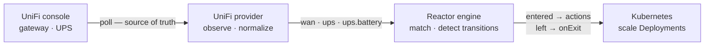

<picture>
  <source media="(prefers-color-scheme: dark)" srcset=".github/assets/banner-dark.svg">
  
</picture>

<p align="center">
  <a href="https://github.com/robbeverhelst/unifi-reactor/actions/workflows/test.yml"></a>
  <a href="https://github.com/robbeverhelst/unifi-reactor/releases"></a>
  <a href="https://github.com/robbeverhelst/unifi-reactor/pkgs/container/unifi-reactor"></a>
  <a href="LICENSE"></a>
</p>

<p align="center">
  <a href="#quickstart">Quickstart</a> ·
  <a href="#your-first-automation">First automation</a> ·
  <a href="#state-keys">State keys</a> ·
  <a href="#configuration">Configuration</a> ·
  <a href="docs/troubleshooting.md">Troubleshooting</a> ·
  <a href="docs/spec.md">Design spec</a>
</p>

---

Your WAN fails over to the 5G backup at 3am. Nothing in the cluster notices: qBittorrent keeps seeding, the nightly backup starts on schedule, and you find out when the data cap bill arrives. Or the power drops, the UPS starts counting down eighteen minutes of battery, and your cluster spends them transcoding video.

Your UniFi gear already knows all of this. **UniFi Reactor** is a Kubernetes operator that turns what it knows — which WAN is live, whether the UPS is on mains — into declarative actions on your cluster.

## Why this exists

- **State, not events** — Reactor polls the UniFi Network API and reconciles against what it observes. A dropped webhook, a network blip, or a controller restart can't strand your cluster in the wrong mode, because the next observation corrects it. Webhooks are an optimization, never the mechanism of record.
- **Reversal is explicit** — an automation says what to do when a condition starts holding, and separately what it wants once it stops. Nothing is inferred, undoing is never guessed, and every execution is recorded in the resource's status.
- **One workload, many automations** — a target's replica count is arbitrated across every automation pointing at it, not written by whichever one saw a transition last. Two automations can pause the same workload for unrelated reasons, and it stays paused until *neither* wants it down.
- **Safe by default** — a dedicated ServiceAccount with exactly the verbs it needs, no `cluster-admin`, no arbitrary shell execution, and credentials read from Kubernetes Secrets. Actions are desired-state (`replicas = 0`), so retrying one is harmless.
- **Boring to operate** — one static binary in a distroless image, no database, no queue, no UI. Small enough to forget about in a homelab.

## How it works



The engine knows nothing about UniFi. A provider converts vendor-specific reality into normalized state, and the engine reconciles your `Automation` resources against it. That seam is what lets other providers — a UPS over NUT, Proxmox, Prometheus alerts — arrive later without touching the core.

Observing `wan: backup` fifty times in a row does nothing fifty times. Scaling is a **desired state**, not a command: Reactor works out what every automation currently wants for a workload and reconciles it there, so the result depends only on which conditions hold — never on the order they were observed in.

## Quickstart

Create an API key in the UniFi UI under **Settings → Control Plane → Integrations**, then:

```sh
kubectl create namespace reactor-system

kubectl -n reactor-system create secret generic unifi-reactor-credentials \
  --from-literal=UNIFI_API_KEY=<your-api-key>

helm install reactor oci://ghcr.io/robbeverhelst/charts/reactor \
  --namespace reactor-system \
  --set unifi.url=https://192.168.1.1
```

Or without Helm, using the manifest bundle from the latest release:

```sh
kubectl apply -f https://github.com/robbeverhelst/unifi-reactor/releases/latest/download/install.yaml
```

Confirm it can see your hardware:

```sh
kubectl -n reactor-system logs deploy/reactor | grep 'state transition'
# INFO state transition provider=unifi key=ups from= to=online
# INFO state transition provider=unifi key=wan from= to=primary
```

The first observation reports every key it can see, so these lines are your inventory. For the full per-poll state, set `log.level=debug`.

## Your first automation

Pause downloads while the WAN is on the backup uplink, and resume them when it recovers — one resource covers both directions:

```yaml
apiVersion: reactor.robbeverhelst.com/v1alpha1
kind: Automation
metadata:
  name: pause-downloads-on-backup-wan
  namespace: media
spec:
  when:
    provider: unifi
    state:
      wan: backup

  actions:
    - type: kubernetes.scale
      target: { kind: Deployment, name: qbittorrent }
      replicas: 0

  onExit:
    - type: kubernetes.scale
      target: { kind: Deployment, name: qbittorrent }
      replicas: 1
```

```sh
kubectl -n media get automation
# NAME                           PROVIDER   MATCHING   READY   AGE
# pause-downloads-on-backup-wan  unifi      false      True    12s
```

Shedding load during a power cut is the same shape, matching `ups: on-battery` instead.

## When two automations share a workload

qBittorrent genuinely should pause for *both* a metered uplink and a power cut. Point both automations at it and nothing has to be coordinated by hand:

```sh
kubectl -n media get automation
# NAME                    PROVIDER   MATCHING   APPLIED   AGE
# pause-on-backup-wan     unifi      false      False     3h
# shed-on-battery         unifi      true       True      3h
```

While *any* automation's condition holds, the workload stays at the **most restrictive** replica count asked for. The WAN recovering above does not bring qBittorrent back, because the UPS automation still wants it down — and the automation that lost says so plainly:

```sh
kubectl -n media get automation pause-on-backup-wan -o jsonpath='{.status.targets[0]}'
# {"ref":"Deployment/media/qbittorrent","desired":1,"effective":0,
#  "deferredBy":["media/shed-on-battery"]}
```

The workload comes back only once **no** automation wants it down.

### What "coming back" means

`onExit` declares the value an automation wants once nothing is holding the workload down. Omit it and Reactor restores the **baseline** — what the workload was set to before it first claimed it, recorded on the Deployment itself:

```sh
kubectl -n media get deploy qbittorrent -o jsonpath='{.metadata.annotations}'
# {"reactor.robbeverhelst.com/baseline-replicas":"1",
#  "reactor.robbeverhelst.com/claimed-by":"media/shed-on-battery",
#  "reactor.robbeverhelst.com/claimed-at":"2026-08-13T02:41:07Z"}
```

Those annotations are how a workload explains itself at 3am, and they are removed the moment nothing claims it — after which Reactor asserts nothing and you can scale it by hand freely.

| `spec.reversal` | What the automation wants once nothing claims the target | Default when |
| --- | --- | --- |
| `Declared` | the values in `onExit` | `onExit` is set |
| `Baseline` | whatever the target was before Reactor first claimed it | `onExit` is omitted |
| `None` | nothing — leave it wherever it was left | never; opt in explicitly |

> **Upgrading from v0.3.0:** an automation with no `onExit` used to leave its workload scaled down permanently. It now restores the baseline instead. Set `reversal: None` to keep the old behaviour.

> **GitOps:** Reactor writes `spec.replicas` and the three annotations above onto target Deployments. If Flux or Argo CD manages those Deployments it will report drift and revert them. Exclude the fields on any workload you let Reactor act on — Argo CD `ignoreDifferences` on `/spec/replicas` and the `reactor.robbeverhelst.com` annotations, or a Flux `patch` with the same exclusions.

### When an action fails

Each action is bounded by `timeoutSeconds` (default 30), so a target that has stopped answering fails and is retried rather than occupying the reconciler. Retries back off exponentially from 2s to a 1-minute cap and stop after five consecutive failures — at which point the automation says so and waits for the next state change instead of retrying forever:

```sh
kubectl -n media get automation pause-on-backup-wan -o jsonpath='{.status.conditions[?(@.type=="Applied")]}'
# {"type":"Applied","status":"False","reason":"RetryBudgetExhausted",
#  "message":"giving up after 5 attempts, will try again on the next state change: ..."}
```

`Ready` tells you whether an automation is healthy; `Applied` tells you whether what it wants is what its targets have. An automation that is outvoted by a more restrictive claim is `Ready=True, Applied=False` — working exactly as intended.

### Removing an automation, or Reactor itself

Deleting an automation while it is holding a workload down hands the workload back rather than stranding it — a finalizer releases the claim first. Removing the policy removes its effect, even mid-outage, so an automation deleted while the UPS is still on battery brings its workload back up.

`helm uninstall` is the case worth understanding, because Helm does **not** delete the `Automation` CRD or your `Automation` resources. They survive the uninstall and simply stop reconciling. A pre-delete hook therefore releases every claim before the operator goes away, and removes the finalizers, which nothing would be left to service:

```sh
helm uninstall reactor -n reactor-system    # workloads return to their pre-Reactor values
helm uninstall reactor -n reactor-system --no-hooks    # skip it; workloads stay where they are
```

Set `uninstall.releaseClaims: false` to make that skip the default. Either way, every workload keeps its `baseline-replicas` annotation, so what it was before Reactor touched it is always recoverable by hand.

What is **not** covered: deleting the operator's Deployment directly, or losing the cluster. Reactor does not supervise its own absence — the annotations are the answer there. And if you ever delete an automation while the controller is down, its finalizer has nothing to release it:

```sh
kubectl patch automation <name> -n <namespace> \
  --type=merge -p '{"metadata":{"finalizers":[]}}'
```

## State keys

Each key is published only when the matching hardware is adopted by your controller.

| Key | Values | Meaning |
| --- | --- | --- |
| `wan` | `primary`, `backup` | which uplink the gateway is currently using |
| `isp` | a slug, e.g. `telenet`, or `unknown` | the carrier behind the live uplink |
| `ups` | `online`, `on-battery` | whether a UniFi UPS is on mains or running on battery |
| `ups.battery` | `normal`, `low`, `critical` | remaining charge against the configured thresholds |

`isp` is the one key whose values are not a closed set: it is the carrier name your console geolocated your public address to, lowercased with everything non-alphanumeric turned into a hyphen. Look it up before matching on it —

```sh
kubectl -n reactor-system logs deploy/reactor | grep 'key=isp'
# INFO state transition provider=unifi key=isp from= to=telenet
```

— and use it when *who* is carrying your traffic is what matters rather than which port it leaves by, which is usually the case for anything metered:

```yaml
  when:
    provider: unifi
    state:
      isp: unknown        # or your backup carrier's slug
```

It exists for a second reason. `wan` and `isp` are independent answers to "did the uplink change", so Reactor compares them: if one moves and the other does not, it says so rather than quietly trusting either. Those lines are worth reading — see [`wan` and `isp` disagree](docs/troubleshooting.md#10-wan-and-isp-disagree-about-a-failover).

`ups` and `ups.battery` are separate on purpose. An automation matching `ups: on-battery` stays matched for the whole outage as the battery drains — with a single escalating enum, dropping from `on-battery` to `low-battery` would leave the matching state and fire `onExit`, scaling workloads back **up** in the middle of a power failure. Express escalation by matching both keys instead; all keys in a `state` block must match.

```yaml
  when:
    provider: unifi
    state:
      ups: on-battery
      ups.battery: critical
```

If a provider stops reporting a key at all — the hardware dropped off the controller — Reactor holds the last known state and reports `Ready=False` with `StateKeyUnavailable` rather than treating lost visibility as a condition that ended ([what to do about it](docs/troubleshooting.md#2-statekeyunavailable-and-held-state)).

### Settling a noisy signal

A changed value can be required to hold for several consecutive observations before Reactor acts on it, which stops one flapping signal driving repeated actions:

```yaml
unifi:
  debounce:
    default: 1          # react on the first observation
    keys:
      ups.battery: 2    # ...but let a threshold crossing settle
      isp: 2            # ...and let a re-geolocated carrier settle
```

Each extra sample costs one `pollInterval` of reaction time, so the default is `1`: a WAN failover and a power cut both deserve an immediate reaction, and neither flaps. `ups.battery` ships at `2` because it is a threshold crossing — a charge hovering at 30% would otherwise report `low`, `normal`, `low` — and because a battery drains over minutes, so spending one more poll to be sure costs nothing. At the default 30s poll that makes a battery-level escalation react in 60s worst case instead of 30s.

`isp` ships at `2` for a different reason: it is not a link state but the result of a geolocation lookup on whatever public address the gateway currently holds, so it can report `unknown` for a poll or two while a new address is being resolved — precisely during the failover you would be reacting to. One extra sample skips that window. Nothing else needs it: `wan` and `ups` are switch positions, and they do not flap.

Debouncing happens in the shared state store, so every automation sees the same settled value. Two automations can never disagree about the current state and fight over a workload they share.

## Configuration

Chart values ([full reference](charts/reactor/README.md)):

| Value | Default | Description |
| --- | --- | --- |
| `crds.install` | `true` | install and upgrade the `Automation` CRD with the release |
| `unifi.url` | — | UniFi console base URL; the provider stays disabled until this is set |
| `unifi.site` | `default` | UniFi Network site |
| `unifi.pollInterval` | `30s` | how often WAN and UPS state are observed |
| `unifi.insecureSkipVerify` | `true` | accept the console's self-signed certificate |
| `unifi.existingSecret` | `unifi-reactor-credentials` | Secret holding `UNIFI_API_KEY`; re-read on every poll, so rotating the key needs no restart |
| `log.level` | `info` | `debug` adds the per-observation lines used to work out why an automation did not fire |
| `unifi.ups.lowBatteryPercent` | `30` | charge at or below this reports `ups.battery: low` |
| `unifi.ups.criticalBatteryPercent` | `10` | charge at or below this reports `ups.battery: critical` |
| `unifi.webhook.enabled` | `false` | webhook fast path (below) |
| `rbac.clusterWide` | `true` | when `false`, restricts the operator to its own namespace |

`Automation` resources are namespaced. An action targets its own namespace by default; naming a different one in `target.namespace` requires `rbac.clusterWide: true`.

### Webhook fast path

Reactions are normally no faster than `unifi.pollInterval`. UniFi's Alarm Manager can post to Reactor instead, cutting that to about a second — and Reactor can create that Alarm Manager rule itself, rather than asking you to click through the UniFi UI.

It is off by default and stays an optimization. A delivery **triggers a poll**; it never sets state. Its payload is not parsed at all, so a delivery that is dropped, duplicated, replayed or forged costs at most one extra request to your console. Every delivery must present a shared secret, the receiver is not exposed outside the cluster unless you expose it, and self-registration fails soft — if the console does not behave as expected, Reactor logs why and carries on polling.

See the [chart reference](charts/reactor/README.md#webhook-fast-path-optional-off-by-default) for the values, how to make the receiver reachable from your console, and what is worth knowing before turning self-registration on.

## Documentation

- [Troubleshooting](docs/troubleshooting.md) — nothing is happening, `StateKeyUnavailable`, credentials, CRD upgrades, RBAC, stranded workloads
- [Adding a provider](docs/adding-a-provider.md) — the `Observe` contract, the state vocabulary, and the capture policy, walked through the UniFi provider
- [Design spec](docs/spec.md) — the architecture, the state-first rationale, and the roadmap in full
- [Chart reference](charts/reactor/README.md) — every value, both RBAC modes
- [Captured UniFi payloads](testdata/unifi/README.md) — the real API responses every parser is written and tested against
- [UniFi Alarm Manager API](docs/unifi-alarm-manager-api.md) — reverse-engineered notes on configuring UniFi's outbound webhooks programmatically
- [Development](docs/development.md) — building, testing, and running against a local cluster
- [Contributing](CONTRIBUTING.md) — the dev loop, conventional commits, and the fixture capture policy
- [Security policy](SECURITY.md) — how to report a vulnerability, and how to verify a signed release

## Stability

Early days: the API group is `v1alpha1` and the project is pre-1.0, so expect breaking changes between minor versions. The two trigger kinds (`when` for state, `trigger` for events) are settled and won't be collapsed — that split exists precisely so state-shaped automations never have to migrate.

**The name stays `unifi-reactor` through v1**, and adding providers does not change that. The user-facing surface is already provider-neutral — the API group is `reactor.robbeverhelst.com`, the kind is `Automation` with a `provider` field, the chart is `reactor`, the namespace is `reactor-system` — so a NUT, Proxmox, or Prometheus provider lands with no breaking change and nothing to migrate. Only the repository, the Go module path, and the image carry the `unifi-` prefix, and those are the surfaces you touch least. Discovery favours the specific name besides: people search for a UniFi Kubernetes operator, and `reactor` alone has a lot of prior art. If a second provider ever gains real users, renaming is a repository rename (GitHub redirects), a transition period publishing the image under both paths, and a major-version bump of the module path — a decision for when it has users, not for a version boundary on its own.

Parsers are written against real captured API responses committed to [`testdata/`](testdata/unifi/), never against assumed formats. Two caveats worth stating plainly. The `wan` mapping is derived from a gateway with a second uplink configured, but a genuine failover has not yet been observed end-to-end, so treat `wan` as less battle-tested than `ups`. And the webhook fast path has been exercised against the mock console, not a real one — which is a large part of why it defaults off and why nothing depends on it being right.

## Roadmap

- Event triggers for genuinely point-in-time things, like a client connecting
- More actions: HTTP requests, notifications, `restart`, CronJob suspend
- Prometheus metrics and richer status conditions
- More providers, driven by demand: NUT, Proxmox, Prometheus alerts, Home Assistant

Non-goals: replacing UniFi Network or UniFi OS, becoming a general-purpose workflow engine like n8n or Argo Workflows, replacing Home Assistant, or executing arbitrary shell commands.

## Contributing

PRs welcome — [CONTRIBUTING.md](CONTRIBUTING.md) has the full version, including the fixture capture policy, which is a genuinely unusual rule and not one you would guess. The short version:

```sh
make test          # unit + envtest
make lint          # golangci-lint
make dev-deploy DEV_CONTEXT=<your-cluster> UNIFI_URL=... UNIFI_API_KEY=...
```

No UniFi hardware needed — `make dev-mock` serves the captured payloads and rehearses a WAN failover or a power outage on demand. Conventional commits; tagging `vX.Y.Z` builds and publishes the multi-arch image, the OCI chart, and `install.yaml` from CI, with [generated release notes standing in for a changelog](CHANGELOG.md).

Bug reports go through the [issue templates](https://github.com/robbeverhelst/unifi-reactor/issues/new/choose), which ask for the four things that make a report reproducible. Participation is covered by the [Code of Conduct](CODE_OF_CONDUCT.md).

## License

[Apache 2.0](LICENSE)
