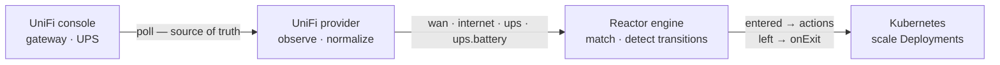

<picture>
  <source media="(prefers-color-scheme: dark)" srcset=".github/assets/banner-dark.svg">
  
</picture>

<p align="center">
  <a href="https://github.com/robbeverhelst/unifi-reactor/actions/workflows/test.yml"></a>
  <a href="https://github.com/robbeverhelst/unifi-reactor/releases"></a>
  <a href="https://github.com/robbeverhelst/unifi-reactor/pkgs/container/unifi-reactor"></a>
  <a href="LICENSE"></a>
</p>

<p align="center">
  <a href="#quickstart">Quickstart</a> ·
  <a href="#your-first-automation">First automation</a> ·
  <a href="#state-keys">State keys</a> ·
  <a href="#compatibility">Compatibility</a> ·
  <a href="#configuration">Configuration</a> ·
  <a href="docs/troubleshooting.md">Troubleshooting</a> ·
  <a href="docs/spec.md">Design spec</a>
</p>

---

Your WAN fails over to the 5G backup at 3am. Nothing in the cluster notices: qBittorrent keeps seeding, the nightly backup starts on schedule, and you find out when the data cap bill arrives. Or the power drops, the UPS starts counting down eighteen minutes of battery, and your cluster spends them transcoding video.

Your UniFi gear already knows all of this. **UniFi Reactor** is a Kubernetes operator that turns what it knows — which WAN is live, whether the UPS is on mains — into declarative actions on your cluster.

## Why this exists

- **State, not events** — Reactor polls the UniFi Network API and reconciles against what it observes. A dropped webhook, a network blip, or a controller restart can't strand your cluster in the wrong mode, because the next observation corrects it. Webhooks are an optimization, never the mechanism of record.
- **Reversal is explicit** — an automation says what to do when a condition starts holding, and separately what it wants once it stops. Nothing is inferred, undoing is never guessed, and every execution is recorded in the resource's status.
- **One workload, many automations** — a target's level is arbitrated across every automation pointing at it, not written by whichever one saw a transition last. Two automations can pause the same workload for unrelated reasons, and it stays paused until *neither* wants it down.
- **Safe by default** — a dedicated ServiceAccount with exactly the verbs it needs, no `cluster-admin`, no arbitrary shell execution, and credentials read from Kubernetes Secrets. Scaling is desired-state (`replicas = 0`), so retrying it is harmless; the actions that leave the cluster are refused until you say where they may go.
- **Boring to operate** — one static binary in a distroless image, no database, no queue, no UI. Small enough to forget about in a homelab.

## How it works



The engine knows nothing about UniFi. A provider converts vendor-specific reality into normalized state, and the engine reconciles your `Automation` resources against it. That seam is what lets other providers — a UPS over NUT, Proxmox, Prometheus alerts — arrive later without touching the core.

Observing `wan: backup` fifty times in a row does nothing fifty times. Scaling is a **desired state**, not a command: Reactor works out what every automation currently wants for a workload and reconciles it there, so the result depends only on which conditions hold — never on the order they were observed in.

## Quickstart

Create an API key in the UniFi UI under **Settings → Control Plane → Integrations**, then:

```sh
kubectl create namespace reactor-system

kubectl -n reactor-system create secret generic unifi-reactor-credentials \
  --from-literal=UNIFI_API_KEY=<your-api-key>

helm install reactor oci://ghcr.io/robbeverhelst/charts/reactor \
  --namespace reactor-system \
  --set unifi.url=https://192.168.1.1
```

Or without Helm, using the manifest bundle from the latest release:

```sh
kubectl apply -f https://github.com/robbeverhelst/unifi-reactor/releases/latest/download/install.yaml
```

Confirm it can see your hardware:

```sh
kubectl -n reactor-system logs deploy/reactor | grep 'state transition'
# INFO state transition provider=unifi key=ups from= to=online
# INFO state transition provider=unifi key=wan from= to=primary
```

The first observation reports every key it can see, so these lines are your inventory. For the full per-poll state, set `log.level=debug`.

## Your first automation

Pause downloads while the WAN is on the backup uplink, and resume them when it recovers — one resource covers both directions:

```yaml
apiVersion: reactor.robbeverhelst.com/v1alpha1
kind: Automation
metadata:
  name: pause-downloads-on-backup-wan
  namespace: media
spec:
  when:
    provider: unifi
    state:
      wan: backup

  actions:
    - type: kubernetes.scale
      target: { kind: Deployment, name: qbittorrent }
      replicas: 0

  onExit:
    - type: kubernetes.scale
      target: { kind: Deployment, name: qbittorrent }
      replicas: 1
```

```sh
kubectl -n media get automation
# NAME                           PROVIDER   MATCHING   SUSPENDED   READY   AGE
# pause-downloads-on-backup-wan  unifi      false      false       True    12s
```

Shedding load during a power cut is the same shape, matching `ups: on-battery` instead.

### Stopping scheduled work

Scaling cannot express "do not start the nightly backup tonight" — that is `spec.suspend` on a CronJob, and it is the single highest-value thing to stop during an outage or on a metered uplink:

```yaml
  actions:
    - type: kubernetes.cronjob.suspend
      target: { kind: CronJob, name: velero-backup, namespace: velero }
```

`suspended` defaults to `true`, which is what the action is named after; write `suspended: false` in `onExit` to ask for it back explicitly, or omit `onExit` and Reactor restores whatever the CronJob was set to before it claimed it.

**Suspending stops new Jobs being created and does nothing to a Job already running.** That is deliberate, and Reactor is not granted any permission over Jobs at all, so it could not delete one if it wanted to: declining to start more work is a very different act from killing work in flight, and killing work in flight is not a decision an outage should make on your behalf. If a running backup is what you need stopped, stop it yourself.

### Closing a node to new work

The endgame of a power cut is a graceful shutdown, not a hard cut. Cordoning a worker running on a dying battery stops new pods landing there, so replacements come up on the node still on mains:

```yaml
  actions:
    - type: kubernetes.cordon
      target: { kind: Node, name: worker-03 }
```

Cordoning is desired-state, like scaling: `spec.unschedulable` is a level, `cordoned` wins over `schedulable` in a fold, and applying it twice is applying it once. `cordoned` defaults to `true`; write `cordoned: false` in `onExit` to reopen explicitly, or omit `onExit` and Reactor restores what it found — **including leaving a node cordoned that you had already cordoned by hand.**

> **It is opt-in, and it is the only permission Reactor asks for that reaches outside the workloads you installed it to manage.** Nodes are cluster-scoped, so `--set rbac.allowNodeActions=true` creates a `ClusterRole` *even in a namespace-scoped install*. It grants `get` and `patch` on nodes; Kubernetes cannot narrow `patch` to one field, so that also permits writing node labels and annotations. Decide whether that is worth it before turning it on. Without it, an automation using `kubernetes.cordon` reports the node as unreachable and names the value to set. The manifest bundle (`install.yaml`) does not offer it at all.

#### Why there is no `kubernetes.drain`

Draining was proposed alongside cordoning and is **deliberately not implemented** — not deferred, not behind a flag. Four reasons, and the first is the one that decides it:

1. **An eviction cannot be un-evicted.** Every other action here declares a *level* that is a pure function of which conditions currently hold, which is what makes the outcome independent of ordering and a controller restart harmless. A drain has no such value: there is no state a node can be held at that means "drained", `onExit` cannot express undoing it, and a flapping key would empty the node again on every flap with nothing to correct it.
2. **In a small cluster it makes things worse.** Draining assumes somewhere else to go. In a three-node homelab on one UPS, the evicted pods do not reschedule — they go `Pending`, so you lose the workload *before* the battery runs out instead of when it does. Cordoning gets the actual benefit here without that cost.
3. **It can evict the operator.** If Reactor's own pod is on the node being drained, the action kills the thing performing and reporting it, mid-action. Nothing else Reactor does can do that.
4. **It hangs, by design.** Eviction respects PodDisruptionBudgets, and a single-replica workload with `minAvailable: 1` blocks forever. That is a bounded-timeout problem on paper and an unbounded blast-radius problem in practice.

So the RBAC that would make it possible is not granted under any setting: `rbac.allowNodeActions` gives access to `nodes` and nothing to `pods` or `pods/eviction`. If your outage plan genuinely needs a drain, `kubernetes.cordon` plus a `notification.*` telling you to run `kubectl drain` yourself is the honest shape — a human is the right thing to make an irreversible cluster-wide decision at 3am.

### The two shapes an action has

| | Declares | Arbitrated? | Types |
| --- | --- | --- | --- |
| **Desired-state** | a *level* — what a target should be | yes, continuously across every automation sharing the target | `kubernetes.scale`, `kubernetes.cronjob.suspend`, `kubernetes.cordon` |
| **Edge** | an *occurrence* | no — fires on this automation's own transition and owns nothing | `kubernetes.restart`, `http.request`, `notification.*`, `homeassistant.service`, `qbittorrent.*`, `unifi.wlan.*` |

`kubernetes.scale` works through the [scale subresource](https://kubernetes.io/docs/reference/using-api/api-concepts/#subresources), so `kind: Deployment` and `kind: StatefulSet` take the same path and Reactor never has to know where a kind keeps its replicas. `target.kind` is still a closed list, on purpose: a kind is only reachable if the chart granted RBAC for it, and RBAC has to name resources explicitly — so an open field would turn a typo into a `Forbidden` discovered *during* the outage, instead of a rejected write at admission.

A level is ordered and nothing else: **lower is more restrictive, and a shared target resolves to the lowest anyone asked for.** For `kubernetes.scale` that is the replica count, so shedding wins. For `kubernetes.cronjob.suspend` and `kubernetes.cordon` it is a switch, ordered so that *suspended* and *cordoned* are the restrictive answers — which means suspended wins over running for exactly the same reason 0 replicas wins over 3, and with no new rule to learn. `status.targets[].level` says which in words.

**What decides which column an action lands in is not whether it expresses a level.** [Pausing torrents](#qbittorrent) plainly does, and so does [a WLAN being enabled](#switching-a-wireless-network-off), and both are edge actions anyway. It is whether there is somewhere to record the value the target held *before* Reactor claimed it — because without that, release cannot put it back, and an automation that cannot hand a target back has no business claiming it. For a Kubernetes object that place is an annotation on the object. For anything else there is no answer yet, which is why every desired-state action so far is a `kubernetes.*` one, and why the actions that reach outside the cluster are named as verbs.

The [HPA decline path](#when-something-else-already-owns-the-workload) is the same rule seen from the other side: a scalable target another controller drives can be refused *and handed back to what it was*, and it can be handed back precisely because the baseline is on the object. Nothing outside the cluster has that, so nothing outside the cluster can be declined back to anything.

### Restarting a workload

The standard remedy for something wedged — a service that needs to re-resolve DNS or re-establish upstream connections once connectivity returns:

```yaml
  onExit:
    - type: kubernetes.restart
      target: { kind: Deployment, name: sonarr }
```

It stamps `kubectl.kubernetes.io/restartedAt` on the pod template, exactly as `kubectl rollout restart` does, so the workload controller rolls the pods under whatever update strategy and disruption budget the workload already declares. Reactor never deletes a pod.

Restart is an **edge** action: there is no value a workload can be held at that means "restarted", so it owns nothing, arbitrates with nothing, and fires on this automation's own transition. Put it in `onExit` when you want it on recovery, as above, and in `actions` when you want it on the way in.

> **It is at-most-once, and it has to be.** Every execution rolls the workload, so a retry after an ambiguous failure would be a second outage rather than a correction. Reactor attempts it exactly once per transition, records the outcome in `status.edgeActions`, and never tries again — the failures that actually happen here (a conflict, a `Forbidden`) are not ones a retry fixes. A restart that did not happen is reported as a `Warning` and leaves the automation `Ready`.

#### Restart is why debounce matters

Everything else Reactor does is safe to repeat: scaling to 0 twice is one scale, suspending a suspended CronJob is nothing. **A restart is not.** The engine only acts on transitions, so a steady condition never restarts anything twice — but a *flapping* state key is a stream of transitions, and each one is a real rollout. A `wan` key oscillating every poll would roll the workload every poll.

The engine's answer is [debounce](#settling-a-noisy-signal), and with `kubernetes.restart` it stops being an optimization:

```yaml
unifi:
  debounce:
    default: 1
    keys:
      wan: 3      # if wan drives a restart, make it prove itself first
```

The shipped default is `1` — react on the first observation — because `wan` and `ups` are switch positions that do not flap, and a failover deserves an immediate reaction. That default is chosen for `kubernetes.scale`. **If a key drives a restart, raise its debounce**, and accept the cost: each extra sample is one `pollInterval` of extra reaction time. Before adding a restart to an automation, ask what the key does when the hardware behind it is halfway broken rather than cleanly up or down — that is the state a restart loop is born in.


## When two automations share a workload

qBittorrent genuinely should pause for *both* a metered uplink and a power cut. Point both automations at it and nothing has to be coordinated by hand:

```sh
kubectl -n media get automation
# NAME                    PROVIDER   MATCHING   SUSPENDED   READY   AGE
# pause-on-backup-wan     unifi      false      false       True    3h
# shed-on-battery         unifi      true       false       True    3h
```

While *any* automation's condition holds, the workload stays at the **most restrictive** level asked for. The WAN recovering above does not bring qBittorrent back, because the UPS automation still wants it down — and the automation that lost says so plainly:

```sh
kubectl -n media get automation pause-on-backup-wan -o jsonpath='{.status.targets[0]}'
# {"ref":"Deployment/media/qbittorrent","desired":1,"effective":0,
#  "deferredBy":["media/shed-on-battery"]}
```

The workload comes back only once **no** automation wants it down.

### What "coming back" means

`onExit` declares the level an automation wants once nothing is holding the workload down. Omit it and Reactor restores the **baseline** — what the target was set to before it first claimed it, recorded on the target itself:

```sh
kubectl -n media get deploy qbittorrent -o jsonpath='{.metadata.annotations}'
# {"reactor.robbeverhelst.com/baseline-replicas":"1",
#  "reactor.robbeverhelst.com/claimed-by":"media/shed-on-battery",
#  "reactor.robbeverhelst.com/claimed-at":"2026-08-13T02:41:07Z"}
```

The baseline annotation is named for what it records, so a CronJob carries `baseline-suspend: "false"` rather than a replica count that would mean nothing there — `baseline-replicas` keeps meaning exactly one replica count, forever. Those annotations are how a workload explains itself at 3am, and they are removed the moment nothing claims it — after which Reactor asserts nothing and you can scale it by hand freely.

| `spec.reversal` | What the automation wants once nothing claims the target | Default when |
| --- | --- | --- |
| `Declared` | the values in `onExit` | `onExit` is set |
| `Baseline` | whatever the target was before Reactor first claimed it | `onExit` is omitted |
| `None` | nothing — leave it wherever it was left | never; opt in explicitly |

> **Upgrading from v0.3.0:** an automation with no `onExit` used to leave its workload scaled down permanently. It now restores the baseline instead. Set `reversal: None` to keep the old behaviour.

> **GitOps:** Reactor writes `spec.replicas` and the three annotations above onto target Deployments. If Flux or Argo CD manages those Deployments it will report drift and revert them. Exclude the fields on any workload you let Reactor act on — Argo CD `ignoreDifferences` on `/spec/replicas` and the `reactor.robbeverhelst.com` annotations, or a Flux `patch` with the same exclusions.

### When an action fails

Each action is bounded by `timeoutSeconds` (default 30), so a target that has stopped answering fails and is retried rather than occupying the reconciler. Retries back off exponentially from 2s to a 1-minute cap and stop after five consecutive failures — at which point the automation says so and waits for the next state change instead of retrying forever:

```sh
kubectl -n media get automation pause-on-backup-wan -o jsonpath='{.status.conditions[?(@.type=="Applied")]}'
# {"type":"Applied","status":"False","reason":"RetryBudgetExhausted",
#  "message":"giving up after 5 attempts, will try again on the next state change: ..."}
```

`Ready` tells you whether an automation is healthy; `Applied` tells you whether what it wants is what its targets have. An automation that is outvoted by a more restrictive claim is `Ready=True, Applied=False` — working exactly as intended.

### Pausing an automation

`spec.suspend: true` takes an automation out of force without deleting it — during an incident, while testing, or when one is misbehaving:

```sh
kubectl -n media patch automation shed-on-battery --type=merge -p '{"spec":{"suspend":true}}'

kubectl -n media get automation
# NAME                    PROVIDER   MATCHING   SUSPENDED   READY   AGE
# pause-on-backup-wan     unifi      false      false       True    3h
# shed-on-battery         unifi      true       true        True    3h
```

**Suspending is a reversible delete, not a freeze.** A suspended automation keeps observing state and reporting `matching`, `observedState` and `lastTransition` — that is what makes it worth leaving in place while you debug — and stops claiming its targets entirely. Each target is arbitrated as if the automation were not there, so it goes back to whatever the other automations claiming it want, or to this one's [`reversal`](#what-coming-back-means) if none do. It reports `Ready=True`, `Applied=False` with reason `Suspended`.

Deletion gives the same answer, on purpose: "pause this" and "remove this" should not mean different things to a workload one of them is holding down. Two consequences worth knowing:

- **A suspended automation cannot strand a workload**, because it is not holding one. Deleting one is equally uneventful — its finalizer has nothing left to release.
- **It never fights you.** A suspended automation writes nothing. If it was the only claimant, Reactor's annotations come off the target as it lets go and you can scale that workload by hand; if another automation still claims it, that one is still in charge and `claimed-by` names it.

Resuming re-evaluates against current state and replays nothing: an automation whose condition still holds re-claims its targets on the next reconcile, recording a fresh baseline from whatever the workload is at then.

If what you wanted was "leave the workload exactly where it is", say that explicitly — with nothing else claiming the target, this pauses the automation *and* stops Reactor asserting a value for it:

```sh
kubectl -n media patch automation shed-on-battery --type=merge \
  -p '{"spec":{"suspend":true,"reversal":"None"}}'
```

### Asking what an automation would do

Writing an automation means deciding what should happen to somebody's production workload during an incident you cannot rehearse. `spec.dryRun: true` lets you apply one and be told the answer instead of finding out:

```sh
kubectl -n media get automation shed-on-battery \
  -o jsonpath='{.status.targets[0]}' | jq
# {"ref": "Deployment/media/qbittorrent",
#  "effective": 1,                                  # what it is held at now, by somebody else
#  "preview": {
#    "desired": 0,                                  # what this automation would ask for
#    "effective": 0, "level": "0 replicas",         # what the arbitration would then resolve to
#    "wouldDefer": ["media/pause-on-backup-wan"],   # who would stop getting what they want
#    "onExit": "3 replicas"                         # what it would hand back afterwards
#  }}
```

A dry run is **out of force**, exactly as [suspending](#pausing-an-automation) one is: it claims nothing, writes nothing, and — the part that makes it safe to apply next to policies that are live — cannot change what any other automation's targets resolve to. What it adds is `preview`, which is the same fold run once more with its claim in it. Turning `dryRun` off is the only change needed to make it real.

It answers the question **whether or not the condition currently holds**, because the automation you most want to check is the one for a power cut and you are writing it on a Tuesday afternoon. And it says what it would do at the moment it would have done it:

```sh
kubectl -n media describe automation shed-on-battery | tail -3
# Normal  DryRun  dry run: nothing was written. In force, this automation would
#                 hold Deployment/media/qbittorrent at 0 replicas, outvoting media/pause-on-backup-wan
```

**What a preview cannot promise.** It is computed from the peers, the observed state and the target as they are at that moment, and all three can differ by the time the condition actually holds — another automation may have been written, the workload may have been scaled by hand, the baseline it would restore may not be the one it eventually records. It also says nothing about whether the write would *succeed*: RBAC, an admission webhook, a target that has since been deleted, and [a controller that already owns the field](#when-something-else-already-owns-the-workload) are all outside what arbitration can know. A preview is a fact about a moment, not a forecast.

For a **whole install** that has never acted — a first rollout into a cluster — there is `safety.dryRun: true`, and it is a different thing on purpose:

| | `spec.dryRun` on one automation | `safety.dryRun` on the install |
| --- | --- | --- |
| What it is for | trying one policy on a working install | bringing up an install that has never acted |
| Arbitration | this automation is out of force, so it perturbs nothing | everything stays in force and resolves normally |
| Reported as | `status.targets[].preview` | `status.targets[].effective` — the real fold, unwritten |
| Edge actions | not fired; it is out of force | recorded as `Skipped`, so you can see what would have been sent |
| Enforced by | the operator | the operator **and** the chart, which withholds every permission that could write to a target |

That last row is the point of the install-wide switch: `--dry-run` is Reactor promising not to write, and the missing `patch` and `update` grants are the API server holding it to that. Turning it on for an install that is *already* holding workloads down freezes them where they are, because releasing a claim is a write too — suspend or delete those automations first.

### When something else already owns the workload

Arbitration works because Reactor can see every claimant. A HorizontalPodAutoscaler writes the same `spec.replicas` and is not an automation, so there is nothing to fold it into: Reactor scales to 0 to shed load, the HPA computes a count from metrics and scales it back, and fifteen seconds later Reactor scales it to 0 again. Neither is wrong; they both believe they own the field.

`safety.detectHPA: true` makes Reactor look before it claims, and decline:

```sh
kubectl -n media get automation shed-on-battery -o jsonpath='{.status.targets[0]}'
# {"ref":"Deployment/media/api","desired":0,
#  "managedBy":"HorizontalPodAutoscaler/media/api-hpa"}

kubectl -n media describe automation shed-on-battery | tail -2
# Warning  TargetManagedByHPA  not claiming Deployment/media/api is driven by
#                              HorizontalPodAutoscaler/media/api-hpa: arbitration cannot resolve
#                              a claimant it cannot see, and writing anyway would oscillate rather than win
```

Nothing is written to that target — not the replica count, and not the baseline annotation, because a baseline captured from a value the HPA is actively changing would mean nothing when a later reversal restored it. The automation stays `Ready=True`: it is correctly configured, it simply cannot act there. Its other targets are unaffected.

**A workload Reactor is already holding is handed back** when an HPA appears over it, to the baseline, and then let go. That case is the one worth getting right: an HPA will not scale a workload up from zero, so going quiet while holding it at 0 would leave it there with neither controller willing to move it.

**There is deliberately no `force`.** Overriding would mean writing `spec.replicas` harder, which is the oscillation, not a way out of it. The thing that would actually work is suspending the HPA — patching its `minReplicas`/`maxReplicas` — and that needs *write* access to somebody's autoscaling policy, which is a much larger permission and a separate decision. If you genuinely want Reactor to win during an outage, remove or suspend the HPA, or point the automation at something else: `kubernetes.cronjob.suspend` and `kubernetes.cordon` shed real load and nothing autoscales them.

Detection is **off by default**, because turning it on changes what an install already in that fight does and costs a permission — `list` on `autoscaling/horizontalpodautoscalers`, granted only when the value is set. That is a read of an autoscaling *policy*: Reactor gets no write to an HPA and nothing over the workloads one manages. With detection off the behaviour is unchanged, which is to say Reactor writes and is written over.

And an honest limit: the general problem is not solvable by detection. KEDA, a GitOps controller correcting drift, and a cron job running `kubectl scale` own `spec.replicas` just as hard, and none of them is discoverable through a stable API. An HPA is the common case and the one that can be seen. An empty `managedBy` means nothing was found, not that the field is uncontested.

### Removing an automation, or Reactor itself

Deleting an automation while it is holding a workload down hands the workload back rather than stranding it — a finalizer releases the claim first. Removing the policy removes its effect, even mid-outage, so an automation deleted while the UPS is still on battery brings its workload back up.

`helm uninstall` is the case worth understanding, because Helm does **not** delete the `Automation` CRD or your `Automation` resources. They survive the uninstall and simply stop reconciling. A pre-delete hook therefore releases every claim before the operator goes away, and removes the finalizers, which nothing would be left to service:

```sh
helm uninstall reactor -n reactor-system    # workloads return to their pre-Reactor values
helm uninstall reactor -n reactor-system --no-hooks    # skip it; workloads stay where they are
```

Set `uninstall.releaseClaims: false` to make that skip the default. Either way, every workload keeps its `baseline-replicas` annotation, so what it was before Reactor touched it is always recoverable by hand.

What is **not** covered: deleting the operator's Deployment directly, or losing the cluster. Reactor does not supervise its own absence — the annotations are the answer there. And if you ever delete an automation while the controller is down, its finalizer has nothing to release it:

```sh
kubectl patch automation <name> -n <namespace> \
  --type=merge -p '{"metadata":{"finalizers":[]}}'
```

## Telling you what happened

Everything above is invisible unless someone is reading controller logs — including the cases where Reactor deliberately did *nothing*, like holding state when the console went quiet. Two action types fix that by leaving the cluster: `notification.*` sends a message, `http.request` calls anything with an HTTP API.

Both are **edge actions**, like [`kubernetes.restart`](#restarting-a-workload). They fire on this automation's own transitions and own nothing — unlike the desired-state actions, which declare a level that is arbitrated across every automation sharing a target. An edge action in an `onExit` block still fires on this automation's own edge.

```yaml
apiVersion: reactor.robbeverhelst.com/v1alpha1
kind: Automation
metadata:
  name: pause-downloads-on-backup-wan
  namespace: media
spec:
  when:
    provider: unifi
    state:
      wan: backup

  actions:
    - type: kubernetes.scale
      target: {kind: Deployment, name: qbittorrent}
      replicas: 0
    - type: notification.ntfy
      notification:
        secretRef: {name: ntfy-credentials}
        title: "Reactor: {{ .Name }}"
        message: "{{ .Key }} moved from {{ .From }} to {{ .To }}; qbittorrent paused"

  onExit:
    - type: kubernetes.scale
      target: {kind: Deployment, name: qbittorrent}
      replicas: 1
    - type: notification.ntfy
      notification:
        secretRef: {name: ntfy-credentials}
        message: "{{ .Key }} back to {{ .To }}; qbittorrent resumed"
```

Transports shipped: `notification.ntfy`, `notification.discord`, `notification.slack`. Telegram is not shipped — its bot token lives in the URL path alongside a separate chat id, which does not fit the "the URL is the credential" shape the others share.

### Two things you have to set up first

**1. Allow the destination.** Outbound actions are refused by default and the allowlist is an install value, not something an automation can set:

```yaml
# values.yaml
actions:
  allowedDestinations:
    - https://ntfy.example.com
    - https://discord.com
```

This is the security boundary and it is worth understanding rather than pasting: anyone who can create an `Automation` in their own namespace can ask Reactor to make a request, and that request goes out from inside the cluster with the operator's network position rather than theirs. [SECURITY.md](SECURITY.md#outbound-actions) has the reasoning and what is refused whatever you list.

**2. Put the destination in a Secret.** For every transport shipped, the webhook URL *is* the credential — so a notification has no URL field at all:

```sh
kubectl -n media create secret generic ntfy-credentials \
  --from-literal=url=https://ntfy.example.com/your-topic \
  --from-literal=authorization="Bearer tk_example"
```

| Secret key | Used for |
| --- | --- |
| `url` | the destination. Required for `notification.*`; for `http.request`, an alternative to `request.url` |
| `authorization` | sent as the `Authorization` header |
| `header-<Name>` | sent as the header `<Name>`, e.g. `header-X-Api-Key` |

The Secret must be in the automation's own namespace, and nothing from it is ever logged, put in status, or attached to an Event.

### Messages

`title`, `message` and `http.request`'s `body` are Go [`text/template`](https://pkg.go.dev/text/template) — the standard library, no Sprig:

| | |
| --- | --- |
| `.Automation` `.Namespace` `.Name` | who reacted |
| `.Provider` `.Matching` | which provider, and which direction the edge went |
| `.Key` `.From` `.To` | the transition that flipped `matching` |
| `.State` | every key this automation watches, e.g. `{{ .State.wan }}` |
| `.Time` | when the transition was observed, RFC 3339 |
| `json` | quotes a value for embedding in JSON: `{"wan": {{ json .To }}}` |

Only the message and the body are templated. The URL and the headers are literal on purpose — the destination is what the allowlist decided, and letting observed state edit it would hand back exactly the choice the allowlist exists to take away.

A key that does not exist is an error rather than the words `no value`, so a typo fails loudly at the moment the notification would have gone out. That covers `{{ .State.wan }}`; the `index` builtin (which you need for a dotted key, `{{ index .State "ups.battery" }}`) returns an empty string instead.

Values are treated as data, not structure, whatever they contain — which matters most for [`isp`](#state-keys), the one key whose values are an open set rather than an enum. Notification bodies are built with a JSON encoder rather than by string formatting, `json` is there so an `http.request` body can embed a value without hand-quoting it, and anything travelling in a header is reduced to printable ASCII.

### `http.request`

```yaml
- type: http.request
  request:
    method: POST                       # GET, POST, PUT or PATCH; defaults to POST
    url: https://example.com/hook      # or omit it and put url in the Secret
    secretRef: {name: hook-credentials}
    headers:
      - name: X-Reactor-Source
        value: homelab
    body: '{"automation": {{ json .Automation }}, "wan": {{ json .To }}}'
  timeoutSeconds: 10
```

### When a notification fails

**A failed notification never fails the automation.** The scale is the thing that had to happen; the notification is the report of it. So a failure is recorded in `status.edgeActions` and raised as a Warning `Event`, and `Ready` stays whatever the target reconciliation made it:

```sh
kubectl -n media get automation pause-downloads-on-backup-wan -o jsonpath='{.status.edgeActions}'
# [{"type":"notification.ntfy","status":"Failed","attempts":3,
#   "destination":"https://ntfy.example.com:443",
#   "reason":"https://ntfy.example.com:443: responded 502 Bad Gateway",...}]

kubectl -n media describe automation pause-downloads-on-backup-wan
# Warning  EdgeActionFailed  notification.ntfy was not delivered: ...
```

Ordering and delivery, stated plainly because they are choices rather than accidents:

- **The scale happens first.** A transition whose target could not be written is not committed, so nothing announces a workload was paused while it is still running. It is announced on the retry that succeeds.
- **At most once per transition.** The transition is written to status *before* anything is sent, so a failed or conflicting status write cannot send the same message twice. Nothing is re-sent on a later reconcile — that reconcile has no new transition, so a re-send would be a duplicate, not a retry.
- **Retries happen inside the one reconcile.** A notification is a publish, so it is tried three times against a timeout, a 5xx or a 429. `http.request` is not: `GET` and `PUT` retry ([RFC 9110](https://www.rfc-editor.org/rfc/rfc9110#name-idempotent-methods) calls them idempotent), and `POST` and `PATCH` are attempted exactly once unless you set `request.idempotent: true`. Reactor cannot tell your webhook from your order API, and a duplicate side effect is worse than a missed one when nobody knows what the side effect is.
- **A suspended automation sends nothing**, the same way a deleted one does not. Suspending is a reversible delete.
- **Nothing fires on deletion.** Deleting an automation is not a state transition, and a "WAN recovered" message caused by a `kubectl delete` would be a lie.

## Acting on things outside the cluster

`http.request` can already reach anything with an HTTP API, and for a one-off webhook that is the right tool. The action types below exist because two integrations are worth naming: they are used often enough that writing the URL out every time is a papercut, and — more importantly — a named action can constrain the request in ways a generic one cannot.

They are **the same transport**. The same install-level `actions.allowedDestinations` allowlist, the same address floor enforced in the dialer, the same refusal to follow redirects, the same rule that credentials come only from a Secret in the automation's own namespace, and the same origin-only reporting. There is one outbound HTTP client in Reactor and everything here goes through it. [SECURITY.md](SECURITY.md#outbound-actions) has the reasoning.

### Home Assistant

```yaml
  actions:
    - type: homeassistant.service
      homeAssistant:
        url: https://home-assistant.example.com
        secretRef: {name: home-assistant-credentials}
        domain: notify
        service: persistent_notification
        data: '{"message": "the cluster is on battery", "title": "Reactor"}'
```

It calls `POST /api/services/<domain>/<service>` — `light.turn_on`, `script.turn_on`, `notify.mobile_app_phone`, anything Home Assistant exposes as a service. The credential is a [long-lived access token](https://www.home-assistant.io/docs/authentication/#your-account-profile):

```sh
kubectl -n media create secret generic home-assistant-credentials \
  --from-literal=authorization="Bearer eyJhbGci..."
# the base address may live in the secret instead, under url
```

**The direction is the point.** Home Assistant can already see UniFi — it has an integration for it, and it does presence better than Reactor ever would. What it cannot see is the cluster. So the interesting flow is not Reactor learning that a phone came home; it is Reactor telling Home Assistant that the uplink failed over, the UPS is on battery, or a node was cordoned, and letting Home Assistant do the physical thing. That is why [#10 (`client.<name>`) and #26 (`unifi.client.block`)](https://github.com/robbeverhelst/unifi-reactor/issues/27) were closed rather than built, and this action is the seam that decision rests on.

Three things are narrower than `http.request` on purpose:

- **The path is built, not written.** `domain` and `service` are the only part an automation chooses, and both are restricted to a bare slug — lowercase letters, digits and underscores — at admission *and* again when the URL is built. Without that, "call a service" would quietly be "make any request to an allowed host", which is a real action with a real name and this is not it. A base URL carrying a path is fine (an instance behind a reverse proxy keeps its prefix); a query or fragment on it is refused.
- **`data` must render to a JSON object.** It is templated like any other body, and checked before it is sent — a template that rendered to a list, a bare string or nothing is reported against the automation rather than collected as a 400 from Home Assistant with nothing naming who produced it. Omit it and Reactor sends `{}`.
- **It is attempted exactly once.** `light.turn_on` is idempotent; `script.turn_on`, `notify.*` and `button.press` are not, and Reactor cannot tell which one it was handed. You can: set `idempotent: true` and it retries a timeout or a 5xx like a notification does.

A missing `authorization` key is refused before anything is sent, because Home Assistant answers an unauthenticated call with a 401 that says nothing about which automation produced it.

### qBittorrent

Scaling qBittorrent to zero is the [first automation in this README](#your-first-automation), and it is a blunt instrument: it kills the container, drops every in-progress connection, and relies on qBittorrent recovering its session from disk. Pausing is what you actually wanted — traffic stops, state is preserved, resume is instant:

```yaml
  actions:
    - type: qbittorrent.pause
      qbittorrent:
        url: http://qbittorrent.media.svc.cluster.local:8080
        secretRef: {name: qbittorrent-credentials}

  onExit:
    - type: qbittorrent.resume
      qbittorrent:
        url: http://qbittorrent.media.svc.cluster.local:8080
        secretRef: {name: qbittorrent-credentials}
```

```sh
kubectl -n media create secret generic qbittorrent-credentials \
  --from-literal=username=reactor \
  --from-literal=password='...'
```

Both credentials are required. An instance configured to bypass authentication for its subnet is already expressible as a single `http.request` — a `POST` to `/api/v2/torrents/pause` with `hashes=all` — and that is the honest thing to write for it. The login round trip is the entire reason this action exists rather than being an example.

#### It is a level in the world and an edge action here

This is the part worth reading before using it, because the limitation is real and stated rather than hidden.

Paused-versus-running is a **level**. Every level Reactor holds is arbitrated: two automations pausing the same thing for unrelated reasons resolve to one claim, and it stays paused until *neither* wants it paused. That is how [`kubernetes.scale` behaves](#when-two-automations-share-a-workload), and it is what you would want here.

What makes arbitration possible is not the fold. It is that the target is a **Kubernetes object**, so the value it held before Reactor first touched it can be written as an annotation *on that object* — `reactor.robbeverhelst.com/baseline-replicas` — where it outlives the automation, outlives Reactor, and can be read by the pre-delete sweep during an uninstall. A qBittorrent instance reached over HTTP has none of that: no Kubernetes identity to arbitrate over, nowhere to put a baseline, and nothing the uninstall hook could reach even if there were, since it runs with no credentials and no destination allowlist.

Three ways out were available:

| | Why not |
| --- | --- |
| Keep the baseline in the automation's `status` | It dies with the automation — which is exactly the case where release matters. The annotation lives on the *target* for this reason. |
| Keep it in qBittorrent, as a tag or a category | It writes Reactor's bookkeeping into your torrent data, where you can edit it, and it does not survive a torrent being removed and re-added. Reading it back would also mean parsing a response body into Reactor, which the outbound client deliberately cannot do. |
| Synthesize a Kubernetes identity for it | It would arbitrate on string equality of a URL, silently stop arbitrating when two automations spelled the same instance differently, and produce a `status.targets` entry Reactor cannot verify. Arbitration that is sometimes right is worse than none. |

So it ships as an edge action, named as a verb, and **two limitations follow**:

- **It is not arbitrated.** Two automations pausing the same instance do not resolve to one claim. Each fires on its own transition, and whichever resumes first resumes everything. If you need arbitration today, use `kubernetes.scale` on the Deployment — bluntness buys you the fold.
- **There is no baseline, so `resume` resumes everything.** Including torrents you had paused by hand before Reactor ever ran. Nothing can tell those apart, because nothing recorded which they were. This is the same failure mode the [node cordon baseline](#closing-a-node-to-new-work) exists to prevent, and here it cannot be prevented.

A design for non-Kubernetes desired-state targets — somewhere legitimate to keep a baseline and a claim for a thing with no object to hang them on — **does not exist yet**. When it does, this action becomes a level and the two limitations go away. Until then, an edge action that says what it is beats a desired-state action that pretends to arbitrate.

The two are also complementary rather than exclusive. Pause on the way in *and* let a `kubernetes.scale` claim the Deployment for the harder cases; the scale is still arbitrated normally, because a Deployment is still a Deployment.

#### The session, and the rule it had to fit

Everything else here authenticates with a token you hold. qBittorrent issues one: `POST /api/v2/auth/login` returns a `SID` cookie, and that cookie is a bearer of the same authority as the password. Reactor's rule is that a credential is never held longer than the request that uses it, and a cached session would be exactly the thing that rule forbids for the password itself.

So there is no session cache and no session store. **The login happens inside the one action**, the cookie lives in a local variable for the two requests that need it, and a `POST /api/v2/auth/logout` ends the session on the far end rather than leaving it to expire. The cost is one extra round trip per action. The benefit is that the rule holds as written, on both ends of the connection — and a retry logs in again rather than reusing a cookie from the attempt that just failed.

Three details that follow:

- **A rejected credential is a 200.** qBittorrent answers a wrong username or password with `200 OK` and the body `Fails.`, setting no cookie — so the *absence* of the cookie is the authentication check, and it is reported as a failure rather than a success. It is not retried: a rejected credential does not get better by asking again.
- **Every leg is checked against the allowlist separately**, and the whole exchange is one attempt for retry purposes.
- **This is the one edge action that can argue idempotence** rather than assert it, so it retries a timeout or a 5xx like a notification does: pausing a paused torrent is a no-op, and so is resuming a running one.

`pause` and `resume` are the long-standing WebUI API names. qBittorrent 5.0 introduced `stop` and `start` and deprecated these; deprecated is not removed, and an instance that has removed them answers `404`, which lands in `status.edgeActions[].reason` with the status in it.

**Every torrent, or none.** There is no category or tag filter. Narrowing to one would mean listing torrents and reading the response back into Reactor, and the outbound client deliberately drains and discards every response body — a response can echo a request back, credentials included. That capability is not worth adding for a filter.

## Changing things on your UniFi console

Everything above reaches *out* of the cluster to an address you allowlisted. The action here reaches *back at the console Reactor watches*, and they are a different kind of risk: they are the first things Reactor changes on your network rather than reads from it, and the people they affect are not running the cluster.

> ⚠️ **Nothing here has ever been run against a real console.** The way Reactor authenticates a write was worked out against a live UDM Pro, but every endpoint under it is inferred from how UniFi's own web UI is understood to work. [`docs/unifi-write-api.md`](docs/unifi-write-api.md) says exactly which is which. Everything is exercised against `hack/mock-unifi`, and a mock proves the wiring, not the protocol.

Three properties hold for anything in this section, and they are what make it safe enough to ship at all:

- **You decide what may be touched, at install time.** `unifi.actions.allowedWlans` is a Helm value, empty by default, and empty refuses everything with a reason naming the value to add. There is no per-automation override — `spec.actions` is writable by anyone who can create an `Automation` in their own namespace, and turning the WiFi off is not a decision that belongs there.
- **Every step checks before it writes.** Read the object, confirm it is the one the automation meant, then act. A check that fails abandons the action and says what did not match; it never writes anyway and it never writes something else.
- **Attempted exactly once.** No retry, in either direction. See [when an action fails](#when-an-action-fails) — the next transition corrects a miss, and nothing corrects a duplicate.

It needs a **UniFi OS local account**, because the API key the poller reads with does not write:

```sh
kubectl -n reactor-system create secret generic unifi-reactor-console \
  --from-literal=UNIFI_USERNAME=reactor \
  --from-literal=UNIFI_PASSWORD='...'
```

That is the same Secret the [Alarm Manager registration](#webhook-fast-path) uses, and it is the same credential — same layer, same session, same CSRF token. Reactor holds no session: it logs in, acts, and logs out, once per action.

### Switching a wireless network off

On a metered 5G uplink, guest WiFi is pure cost:

```yaml
  when:
    provider: unifi
    state: {wan: backup}
  actions:
    - type: unifi.wlan.disable
      wlan: {name: Guest}
  onExit:
    - type: unifi.wlan.enable
      wlan: {name: Guest}
```

```yaml
# values.yaml — without this, the action above is refused
unifi:
  actions:
    allowedWlans:
      - Guest
```

Only `enabled` is ever changed. The write is a read-modify-write, because `rest/wlanconf` offers nothing narrower: Reactor reads the WLAN, changes that one key, and PUTs back **the record it just read**, so it never invents a value for a field it does not understand. It also writes nothing at all when the WLAN is already where you asked for it. What it cannot avoid is that a change you make in the UniFi UI in the two-request window between the read and the write is lost.

#### It is a level, and an edge action, and this one bites

A WLAN being enabled is a level in exactly the way [pausing torrents is](#it-is-a-level-in-the-world-and-an-edge-action-here), and it is an edge action for exactly the same reason: there is nowhere to record what it was before Reactor touched it. Writing that into the WLAN's own configuration is the torrent-tag mistake — it is your config, you can edit it, and the write carrying it has no concurrency control. And releasing a WLAN would mean a credentialed write to the console, which the pre-delete sweep during an uninstall is *designed* to be incapable of.

So, two limitations, and the second is louder here than anywhere else in this README:

- **It is not arbitrated.** Two automations disabling the same SSID do not resolve to one claim; whichever enables it first enables it.
- **Nothing hands it back.** If the exit transition never arrives — you delete the automation, you uninstall Reactor, the state key stops being observable — **the network stays off until a human turns it back on.** There is no baseline, no release, and no pre-delete sweep that can reach it.

Point it at a network whose absence is an inconvenience, not at the one carrying your phones, your cameras, or Reactor's own path to the controller. Reactor has no way to know which is which, which is why the allowlist is yours to write and is empty until you do.

## State keys

Each key is published only when the matching hardware is adopted by your controller.

| Key | Values | Meaning |
| --- | --- | --- |
| `wan` | `primary`, `backup` | which uplink the gateway is currently using |
| `wan.quality` | `good`, `degraded` | how well that uplink has been performing, against the configured thresholds |
| `isp` | a slug, e.g. `telenet`, or `unknown` | the carrier behind the live uplink |
| `internet` | `ok`, `degraded`, `down` | whether the outside world is reachable at all |
| `ups` | `online`, `on-battery` | whether a UniFi UPS is on mains or running on battery |
| `ups.battery` | `normal`, `low`, `critical` | remaining charge against the configured thresholds |
| `ups.runtime` | `ample`, `short`, `critical` | how long the UPS says it can carry its current load |
| `ups.load` | `normal`, `high` | draw as a fraction of the UPS's power budget |

`isp` is the one key whose values are not a closed set: it is the carrier name your console geolocated your public address to, lowercased with everything non-alphanumeric turned into a hyphen. Look it up before matching on it —

```sh
kubectl -n reactor-system logs deploy/reactor | grep 'key=isp'
# INFO state transition provider=unifi key=isp from= to=telenet
```

— and use it when *who* is carrying your traffic is what matters rather than which port it leaves by, which is usually the case for anything metered:

```yaml
  when:
    provider: unifi
    state:
      isp: unknown        # or your backup carrier's slug
```

It exists for a second reason. `wan` and `isp` are independent answers to "did the uplink change", so Reactor compares them: if one moves and the other does not, it says so rather than quietly trusting either. Those lines are worth reading — see [`wan` and `isp` disagree](docs/troubleshooting.md#10-wan-and-isp-disagree-about-a-failover).

### `internet` is the one `wan` cannot express

`wan` says which uplink is *selected*. It stays `primary` when the link is up, the uplink is unchanged, and there is no internet — the failure your gateway's own failover may never act on, because from the gateway's point of view nothing is wrong. `internet` is the key for that case, and it comes from a different place: the console's own `www` health subsystem, which is its judgement about reachability rather than about link state.

```yaml
  when:
    provider: unifi
    state:
      internet: down      # regardless of which uplink is carrying it
```

Both keys are [debounced at 3 samples](#settling-a-noisy-signal), so at the default 30s `pollInterval` an outage takes about **90 seconds** to be believed — and a recovery the same. That is a deliberate trade for not shedding load on one bad probe round; if you need it faster, lower `pollInterval` rather than the debounce, because the three samples are what make the signal trustworthy.

`wan.quality` answers a third question, over a different time horizon: not *is the internet there* but *has this uplink been any good*. It buckets the availability and average latency the console measures against its uptime monitors into two levels, using [thresholds you configure](#configuration). Those numbers are averages over the console's uptime window — 24 hours on the hardware they were captured from — so `wan.quality` describes a link that has been bad rather than one that spiked, and a long outage keeps it `degraded` for the rest of that window.

That is deliberate. A number cannot be a state value at all: `spec.when` matches strings, and a key whose values are continuous can never be exported as a metric label without one series per distinct reading. Bucketing is what makes it a state key, and the two levels are the whole vocabulary.

```yaml
  when:
    provider: unifi
    state:
      wan.quality: degraded   # don't start the big sync on a link that has been flaky
```

Keep them apart when you write automations. `internet: down` is an outage; `wan.quality: degraded` is a bad day; matching both in one `state` block means *both must hold*.

Together they also give the [unverified `wan` mapping](#compatibility) something it has never had — a third opinion from a different endpoint. `stat/health` accumulates uptime per uplink, and uptime is traffic the console watched pass, where `is_uplink` and `uplink.name` are both statements about configuration. If uptime is accumulating on a port other than the one `wan` names, Reactor says so rather than quietly trusting either ([what to do about it](docs/troubleshooting.md#10-wan-and-isp-disagree-about-a-failover)).

`ups` and `ups.battery` are separate on purpose. An automation matching `ups: on-battery` stays matched for the whole outage as the battery drains — with a single escalating enum, dropping from `on-battery` to `low-battery` would leave the matching state and fire `onExit`, scaling workloads back **up** in the middle of a power failure. Express escalation by matching both keys instead; all keys in a `state` block must match.

```yaml
  when:
    provider: unifi
    state:
      ups: on-battery
      ups.battery: critical
```

### Charge is a poor shutdown trigger; runtime is a better one

`ups.battery` ignores load, and load is most of the answer: 30% at 300W and 30% at 900W are very different situations. `ups.runtime` is the UPS's own estimate of how long it can carry what is plugged into it *right now*, bucketed against [thresholds you configure](#configuration), and it is what a shutdown automation should actually match on.

```yaml
  when:
    provider: unifi
    state:
      ups: on-battery
      ups.runtime: critical   # not "the battery is low" — "we are about to run out"
```

`ups.load` is the other half of the same picture: the draw as a fraction of the UPS's power budget. It is what tells you *why* the runtime is short, and it is worth matching before an outage rather than during one — a UPS already running at 85% has no headroom to give you when the power goes.

It is published on mains as well as on battery, deliberately. "Could we even survive an outage right now" is a question worth being able to ask while the lights are still on.

Both are separate keys for the same reason `ups.battery` is: they are independent axes, and an automation matching one must not stop matching because another moved. All four UPS keys are only published when a UniFi UPS is adopted, and `ups.runtime` and `ups.load` are additionally omitted when the UPS reports no runtime estimate or no usable power figures — a missing measurement is never turned into a value.

> ⚠️ `timeToRemain`'s unit is **inferred** to be seconds, from a single observation on a UPS that was not discharging. Nothing in Reactor depended on it before this key existed. Confirm it against a real outage before letting `ups.runtime: critical` shut anything down — [#7](https://github.com/robbeverhelst/unifi-reactor/issues/7) has the procedure.

If a provider stops reporting a key at all — the hardware dropped off the controller — Reactor holds the last known state and reports `Ready=False` with `StateKeyUnavailable` rather than treating lost visibility as a condition that ended ([what to do about it](docs/troubleshooting.md#2-statekeyunavailable-and-held-state)).

### Settling a noisy signal

A changed value can be required to hold for several consecutive observations before Reactor acts on it, which stops one flapping signal driving repeated actions:

```yaml
unifi:
  debounce:
    default: 1          # react on the first observation
    keys:
      ups.battery: 2    # ...but let a threshold crossing settle
      ups.runtime: 2
      ups.load: 3       # ...a live wattage moves second to second
      isp: 2            # ...and let a re-geolocated carrier settle
      internet: 3       # ...and don't believe one bad probe round
      wan.quality: 3
```

Each extra sample costs one `pollInterval` of reaction time, so the default is `1`: a WAN failover and a power cut both deserve an immediate reaction, and neither flaps. `ups.battery` ships at `2` because it is a threshold crossing — a charge hovering at 30% would otherwise report `low`, `normal`, `low` — and because a battery drains over minutes, so spending one more poll to be sure costs nothing. At the default 30s poll that makes a battery-level escalation react in 60s worst case instead of 30s.

`isp` ships at `2` for a different reason: it is not a link state but the result of a geolocation lookup on whatever public address the gateway currently holds, so it can report `unknown` for a poll or two while a new address is being resolved — precisely during the failover you would be reacting to. One extra sample skips that window. `wan` and `ups` need none of this: they are switch positions, and they do not flap.

`ups.runtime` matches `ups.battery` at `2`: it is the same kind of escalation, and its default thresholds are set against that delay rather than in isolation — 2 samples is 60s at the default poll, and a `critical` threshold of 180s leaves two minutes between Reactor believing the reading and the UPS running out. Move one and you have moved the other.

`ups.load` is the exception at `3`, because it is the only key derived from an *instantaneous* measurement: a server spinning up shifts the draw by a few hundred watts in one poll, where a battery drains monotonically over minutes. A momentary burst past 80% must not be a reason to shed load.

`internet` and `wan.quality` ship at `3`, the highest in the chart, because they are the two keys derived from probes to the outside world rather than from anything on your desk. A single poll in which a probe target rate-limits or a resolver blips must not shed a cluster's load. At the default 30s poll that is 90 seconds before either an outage or a recovery is believed — deliberately symmetric, because a link flapping in and out is exactly when repeatedly scaling workloads up and down does the most damage.

Debounce is also the whole of the flap control for `wan.quality`, and that is worth being explicit about, because bucketing a measurement is where a threshold usually needs hysteresis. It does not need it here: debounce promotes a value only after N *consecutive* identical observations, so a measurement hovering on a threshold produces `good`, `degraded`, `good` and is never promoted at all — the key simply holds what it had. A second, differently-shaped flap control in the provider would be a second thing to reason about for a problem the engine already solves for every key.

Debouncing happens in the shared state store, so every automation sees the same settled value. Two automations can never disagree about the current state and fight over a workload they share.

This is the setting to revisit the moment you write a [`kubernetes.restart`](#restart-is-why-debounce-matters): scaling is idempotent and a flap costs nothing, while a restart under a flapping key is a rollout per poll.

## Knowing it is working

Reactor's worst failure is **silent and fails open**. If it stops observing — an expired API key, a rebooted console, a network partition — every automation quietly stops reacting. Nothing in the cluster notices, and the next real outage simply does not get handled. There is no error to find, because nothing errored.

One metric answers that, and it is the reason the rest exist:

```promql
time() - reactor_last_observation_timestamp_seconds
```

Metrics are **off by default** and register on the endpoint controller-runtime already serves — there is no second server and no second auth posture:

```sh
helm upgrade reactor ... \
  --set metrics.enabled=true \
  --set metrics.serviceMonitor.enabled=true \
  --set metrics.rules.enabled=true \
  --set metrics.dashboard.enabled=true
```

| Metric | Type | Answers |
| --- | --- | --- |
| `reactor_last_observation_timestamp_seconds` | gauge | is Reactor still seeing anything |
| `reactor_observations_total` | counter | how often polling succeeds and fails |
| `reactor_state_info` | gauge 0/1 | what each state key holds right now |
| `reactor_state_transitions_total` | counter | how often failover actually happens |
| `reactor_automation_matching` / `_ready` | gauge 0/1 | which policies are in force, and which are broken |
| `reactor_arbitrations_total` | counter | claimed, deferred to a peer, or released |
| `reactor_actions_total` | counter | action outcomes, by type and **kind** |
| `reactor_action_duration_seconds` | histogram | slow or hanging actions |
| `reactor_reaction_latency_seconds` | histogram | observation → action, end to end |
| `reactor_webhook_deliveries_total` | counter | fast-path deliveries accepted, coalesced, refused |
| `reactor_provider_signal_disagreements_total` | counter | two independent signals for one fact disagreeing |

Reconcile counts, queue depth and reconcile latency are controller-runtime's own `controller_runtime_*` series on the same endpoint. Reactor does not reimplement them. It also deliberately **does not re-export UniFi telemetry** — a UniFi exporter covers that better, and Reactor's unique vantage point is the decision layer.

`kind` on `reactor_actions_total` is `desired_state` or `edge`, and no alert should be written without it. A failed `kubernetes.scale` means the cluster is not in the state you asked for. A failed notification means nobody was told — [the workload was still scaled](#when-a-notification-fails), and the automation is still `Ready`. The shipped rules alert on those separately for exactly that reason.

### Cardinality, on purpose

`isp` is the first state key whose values are an **open set** — a carrier slug derived from whatever public address your gateway currently holds. So `reactor_state_info` is published only for keys whose provider declares a closed value set, and `isp` is deliberately not one of them. The transition counter is not labelled by `from`/`to` for the same reason. What a key currently holds is always in `status.observedState` and in an `Event`; what Prometheus keeps is bounded at compile time.

Declaring the vocabulary is also what lets the gauge report `0` for the values a key does *not* hold. Without that, the series for a value it used to hold goes stale at `1` rather than dropping, and every graph built on it lies. All values `0` means the key is not currently observable — the metric side of [`StateKeyUnavailable`](docs/troubleshooting.md#2-statekeyunavailable-and-held-state).

### Alerts and the dashboard

`metrics.rules.enabled` ships a `PrometheusRule` — `ReactorObservationStale` first, then failing observations, failing actions, edge actions failing separately, automations stuck not-ready, and reactions getting slow. `ReactorUPSOnBattery` and `ReactorWANOnBackup` are informational: they let your existing alerting learn what your network already knows.

`metrics.dashboard.enabled` ships a grafana-operator `GrafanaDashboard`. It pins no datasource — you pick one from a variable when you open it — so the same JSON works in any Grafana, and it is a plain file at [`charts/reactor/dashboards/reactor.json`](charts/reactor/dashboards/reactor.json) if you would rather import it by hand.

Both need their operator's CRDs, and both refuse to render without `metrics.enabled` rather than quietly querying series nothing is publishing.

### The other direction: `kubectl describe`

Metrics answer *how often*, across everything. Events answer *what happened*, to this one resource — and they need no Prometheus, no port, and no cluster-admin log access:

```sh
kubectl -n media describe automation pause-downloads-on-backup-wan
```
```text
Type     Reason                     Age    From        Message
----     ------                     ----   ----        -------
Normal   StateEntered               3m12s  automation  wan moved from "primary" to "backup", so the condition started holding
Normal   TargetHeld                 3m12s  automation  Deployment/media/qbittorrent held at 0 replicas
Normal   EdgeActionSent             3m11s  automation  notification.ntfy delivered to https://ntfy.example.com:443 after 1 attempt(s)
Normal   DeferredToOtherAutomation  2m40s  automation  a more restrictive claim is in effect: Deployment/media/qbittorrent held by power/shed-on-battery
Warning  StateKeyUnavailable        1m02s  automation  provider "unifi" stopped reporting ups; holding the last known state rather than treating lost sight of it as the condition ending
Normal   StateExited                18s    automation  wan moved from "backup" to "primary", so the condition stopped holding
Normal   TargetReleased             18s    automation  Deployment/media/qbittorrent released; no automation claims it any more
```

That is the whole failover, in order, including the part where it deliberately did nothing.

`Normal` and `Warning` are used deliberately rather than as a severity dial. Entering a state, scaling a target, releasing one, and **being outvoted by a more restrictive claim** are all `Normal` — the last one especially, because it is how two automations sharing a workload are meant to behave, and reporting it as a fault would train you to ignore Warnings here. `Warning` is reserved for something you have to act on: a held state, a failed action, a retry budget spent, a notification that did not go out.

Volume is bounded by the same rule everywhere: **Events fire on edges, not on states.** A reconcile happens at least every 15s, so anything raised from a steady condition would be an API write every 15 seconds per automation, forever. A target already at the right value produces nothing. A condition that keeps reporting the same reason produces nothing after the first. `ActionFailed` stops at the retry budget, and `RetryBudgetExhausted` replaces it exactly once.

| Reason | Type | Raised when |
| --- | --- | --- |
| `StateEntered` / `StateExited` | Normal | the condition started or stopped holding, naming the key that moved |
| `TargetHeld` / `TargetReleased` | Normal | a write to a target actually happened; the message names the level in words |
| `DeferredToOtherAutomation` | Normal | a peer's more restrictive claim is the one in effect |
| `EdgeActionSent` | Normal | a notification or HTTP request was delivered |
| `StateKeyUnavailable` | Warning | a provider stopped reporting a key, so state is being held |
| `ActionFailed` | Warning | a desired-state action could not be applied |
| `RetryBudgetExhausted` | Warning | Reactor stopped retrying and is waiting for the next state change |
| `EdgeActionFailed` / `EdgeActionSkipped` | Warning | a notification or HTTP request did not go out |
| `ReleaseFailed` | Warning | deletion could not hand a target back and let the object go anyway |
| `EventTriggerRemoved` | Warning | a leftover `spec.trigger` automation that does nothing; delete it |

Events are where a state key with an **open value set** is reported: `isp` is not a metric label, so `isp moved from "carrier-a" to "carrier-b"` lives here and in `status.observedState`. The two halves are complementary on purpose — Prometheus keeps what is bounded, Kubernetes keeps what is specific.

> Events are written to the `events.k8s.io/v1` API and expire on your cluster's retention (an hour by default). They are for the incident you are in, not the audit trail — `status` is the durable record.

## Compatibility

Everything here was built against one setup, and this table says which one. "Verified" means a real capture or a real cluster; "expected" means the code path is version-independent as far as anyone can tell, which is not the same thing.

| | Verified | Expected to work | Known not to work |
| --- | --- | --- | --- |
| UniFi Network | 10.5.67 | 10.x | — |
| Console | UDM Pro (gateway firmware 5.1.26) | UDM/UDM SE/UDR/UXG, Cloud Key with a gateway adopted | a site with no gateway and no UniFi UPS: nothing to observe |
| UPS | UniFi UPS 2U (`USWDA26`, firmware 1.6.1) | any UniFi UPS reporting `vbms_table` | third-party UPS over NUT — a separate provider, not this one |
| Kubernetes | CI: envtest 1.36 API server, and the current kind default node image for e2e | 1.25+ — only long-stable APIs are used (`apps/v1` scale, `policy/v1`, `apiextensions/v1`, leases) | — |
| Helm | 3.x | — | — |

Reactor asks the console what it is running and says so at startup:

```sh
kubectl -n reactor-system logs deploy/reactor | grep -E 'version detected|tested against'
# INFO UniFi Network version detected version=10.5.67 verifiedAgainst=10.5.67 verifiedConsole="UDM Pro"
# INFO Kubernetes version detected version=v1.34.1
```

Outside the range above it warns and **carries on**. Refusing to start against a console that would have worked fine is a worse failure than a log line, and most of them will work fine — the warning exists so that a missing state key reads as an incompatibility rather than as a configuration mistake. If your console is not in the table and it works, [say so](https://github.com/robbeverhelst/unifi-reactor/issues/new/choose): every row here started as somebody's report.

State keys degrade one at a time, so a console with no UniFi UPS still reports `wan` and `isp`, and a gateway whose fields have moved still reports `ups`. That holds across endpoints too: an observation reads `stat/device` and `stat/health`, and a console that answers one but not the other publishes the keys it can. Only observing nothing at all is an error.

## Configuration

Chart values ([full reference](charts/reactor/README.md)):

| Value | Default | Description |
| --- | --- | --- |
| `crds.install` | `true` | install and upgrade the `Automation` CRD with the release |
| `unifi.url` | — | UniFi console base URL; the provider stays disabled until this is set |
| `unifi.site` | `default` | UniFi Network site |
| `unifi.pollInterval` | `30s` | how often WAN, internet and UPS state are observed |
| `unifi.insecureSkipVerify` | `true` | accept the console's self-signed certificate |
| `unifi.existingSecret` | `unifi-reactor-credentials` | Secret holding `UNIFI_API_KEY`; re-read on every poll, so rotating the key needs no restart |
| `log.level` | `info` | `debug` adds the per-observation lines used to work out why an automation did not fire |
| `unifi.ups.lowBatteryPercent` | `30` | charge at or below this reports `ups.battery: low` |
| `unifi.ups.criticalBatteryPercent` | `10` | charge at or below this reports `ups.battery: critical` |
| `unifi.ups.shortRuntimeSeconds` | `600` | remaining runtime at or below this reports `ups.runtime: short` |
| `unifi.ups.criticalRuntimeSeconds` | `180` | remaining runtime at or below this reports `ups.runtime: critical` |
| `unifi.ups.highLoadPercent` | `80` | draw at or above this share of the power budget reports `ups.load: high` |
| `unifi.wan.quality.minAvailabilityPercent` | `99` | availability below this reports `wan.quality: degraded` |
| `unifi.wan.quality.maxLatencyMs` | `150` | average latency above this reports `wan.quality: degraded` |
| `unifi.webhook.enabled` | `false` | webhook fast path (below) |
| `actions.allowedDestinations` | `[]` | where outbound actions may go. Empty refuses all of them, and withholds the operator's read access to Secrets ([why](#telling-you-what-happened)) |
| `metrics.enabled` | `false` | serve `/metrics` on `:8443` over HTTPS behind the API server's authn/authz filter ([above](#knowing-it-is-working)) |
| `metrics.serviceMonitor.enabled` | `false` | scrape it with the Prometheus Operator |
| `metrics.rules.enabled` | `false` | ship the alert rules, `ReactorObservationStale` first |
| `metrics.dashboard.enabled` | `false` | ship the overview dashboard as a grafana-operator `GrafanaDashboard` |
| `rbac.clusterWide` | `true` | when `false`, restricts the operator to its own namespace |
| `safety.dryRun` | `false` | evaluate and report everything, write nothing, and withhold the permissions that could ([above](#asking-what-an-automation-would-do)) |
| `safety.detectHPA` | `false` | notice a HorizontalPodAutoscaler driving a target and decline it rather than fight ([above](#when-something-else-already-owns-the-workload)) |

`Automation` resources are namespaced. An action targets its own namespace by default; naming a different one in `target.namespace` requires `rbac.clusterWide: true`.

### Webhook fast path

Reactions are normally no faster than `unifi.pollInterval`. UniFi's Alarm Manager can post to Reactor instead, cutting that to about a second — and Reactor can create that Alarm Manager rule itself, rather than asking you to click through the UniFi UI.

It is off by default and stays an optimization. A delivery **triggers a poll**; it never sets state. Its payload is not parsed at all, so a delivery that is dropped, duplicated, replayed or forged costs at most one extra request to your console. Every delivery must present a shared secret, the receiver is not exposed outside the cluster unless you expose it, and self-registration fails soft — if the console does not behave as expected, Reactor logs why and carries on polling.

See the [chart reference](charts/reactor/README.md#webhook-fast-path-optional-off-by-default) for the values, how to make the receiver reachable from your console, and what is worth knowing before turning self-registration on.

## Documentation

- [Troubleshooting](docs/troubleshooting.md) — nothing is happening, `StateKeyUnavailable`, credentials, CRD upgrades, RBAC, stranded workloads
- [Adding a provider](docs/adding-a-provider.md) — the `Observe` contract, the state vocabulary, and the capture policy, walked through the UniFi provider
- [Design spec](docs/spec.md) — the architecture, the state-first rationale, and the roadmap in full
- [Chart reference](charts/reactor/README.md) — every value, both RBAC modes
- [Captured UniFi payloads](testdata/unifi/README.md) — the real API responses every parser is written and tested against
- [UniFi Alarm Manager API](docs/unifi-alarm-manager-api.md) — reverse-engineered notes on configuring UniFi's outbound webhooks programmatically
- [Writing to a UniFi console](docs/unifi-write-api.md) — what the `unifi.*` actions send, split into what was observed on real hardware and what is inferred
- [Development](docs/development.md) — building, testing, and running against a local cluster
- [Contributing](CONTRIBUTING.md) — the dev loop, conventional commits, and the fixture capture policy
- [Security policy](SECURITY.md) — the outbound-action threat model, how to report a vulnerability, and how to verify a signed release

## Stability

Early days: the API group is `v1alpha1` and the project is pre-1.0, so expect breaking changes between minor versions.

**`spec.trigger` — the event-shaped trigger kind — has been removed from `v1alpha1`.** Up to v0.3.0 the CRD accepted it, CEL-validated it, and then ignored it: no version of the engine has ever processed an event trigger. A v1 whose API accepts configuration it silently drops is worse than one that does not offer the field at all, so it is gone until it is real. Two things had to exist before it could come back, and one of them now does:

- **an action that expresses an occurrence** — *met.* `http.request` and `notification.*` are edge actions: they fire on a transition rather than declaring a level, so an event trigger now has something to run.
- **a captured delivery to match against** — *still missing, and the blocker.* `trigger.match` matched on payload fields, and no UniFi Alarm Manager payload has ever been captured — [`testdata/unifi/webhooks/`](testdata/unifi/README.md) is empty, and the webhook fast path deliberately never reads a delivery body. Parsers here are written against real captures, never against an assumed shape, and an event matcher is a parser.

The two-kind split itself is unchanged and still the design. `when` is what that promise protects: nothing with an observable current value will be re-modelled as an event, and no state automation has to migrate when `trigger` returns in `v1alpha2` with the shape it always had.

> **Upgrading from v0.3.0:** an Automation using `spec.trigger` can no longer be created or updated, and `spec.when` is now required. Existing ones survive in etcd — Helm never deletes your resources — and keep doing what they always did, which is nothing. Reactor names them in its log and in an Event on the resource; `kubectl delete` them.

**The name stays `unifi-reactor` through v1**, and adding providers does not change that. The user-facing surface is already provider-neutral — the API group is `reactor.robbeverhelst.com`, the kind is `Automation` with a `provider` field, the chart is `reactor`, the namespace is `reactor-system` — so a NUT, Proxmox, or Prometheus provider lands with no breaking change and nothing to migrate. Only the repository, the Go module path, and the image carry the `unifi-` prefix, and those are the surfaces you touch least. Discovery favours the specific name besides: people search for a UniFi Kubernetes operator, and `reactor` alone has a lot of prior art. If a second provider ever gains real users, renaming is a repository rename (GitHub redirects), a transition period publishing the image under both paths, and a major-version bump of the module path — a decision for when it has users, not for a version boundary on its own.

Parsers are written against real captured API responses committed to [`testdata/`](testdata/unifi/), never against assumed formats. Two caveats worth stating plainly.

**A genuine WAN failover has still never been observed** ([#34](https://github.com/robbeverhelst/unifi-reactor/issues/34)). `wan` is derived from which port reports `is_uplink`, inferred from one capture in which only one uplink was live — so whether `is_uplink` follows the traffic or just marks the port configured as primary is unconfirmed. What has changed is that the guess is no longer silent or alone: the gateway's own uplink interface is used as a second opinion where `is_uplink` names no single live port, `isp` (from #6) is compared against `wan` across observations, and any disagreement between them is logged rather than resolved. The provider is exercised against five different hypotheses about what a failover looks like, in tests and in `make dev-mock`, and it reports something defensible under all of them. That is not the same as knowing. Treat `wan` as less battle-tested than `ups`, watch for the [disagreement warnings](docs/troubleshooting.md#10-wan-and-isp-disagree-about-a-failover), and if you have a gateway with two working uplinks, the [capture runbook](testdata/unifi/README.md#capturing-a-real-failover) is fifteen minutes that would close this.

And the webhook fast path has been exercised against the mock console, not a real one — which is a large part of why it defaults off and why nothing depends on it being right.

## Roadmap

- Event triggers for genuinely point-in-time things, like a client connecting — returning as `spec.trigger` in `v1alpha2`, once a real delivery payload has been captured and there is an edge action to run ([why it is not in `v1alpha1`](#stability))
- More actions: `restart`, CronJob suspend, and the UniFi write actions
- Richer status conditions, and debounce made visible in status rather than only in the log
- More providers, driven by demand: NUT, Proxmox, Prometheus alerts, Home Assistant

Non-goals: replacing UniFi Network or UniFi OS, becoming a general-purpose workflow engine like n8n or Argo Workflows, replacing Home Assistant, or executing arbitrary shell commands.

## Contributing

PRs welcome — [CONTRIBUTING.md](CONTRIBUTING.md) has the full version, including the fixture capture policy, which is a genuinely unusual rule and not one you would guess. The short version:

```sh
make test          # unit + envtest
make lint          # golangci-lint
make dev-deploy DEV_CONTEXT=<your-cluster> UNIFI_URL=... UNIFI_API_KEY=...
```

No UniFi hardware needed — `make dev-mock` serves the captured payloads and rehearses a WAN failover or a power outage on demand. Conventional commits; tagging `vX.Y.Z` builds and publishes the multi-arch image, the OCI chart, and `install.yaml` from CI, with [generated release notes standing in for a changelog](CHANGELOG.md).

Bug reports go through the [issue templates](https://github.com/robbeverhelst/unifi-reactor/issues/new/choose), which ask for the four things that make a report reproducible. Participation is covered by the [Code of Conduct](CODE_OF_CONDUCT.md).

## License

[Apache 2.0](LICENSE)
