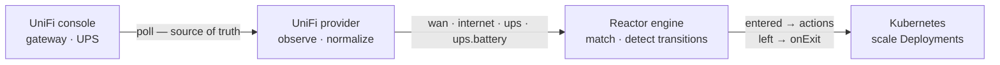

<picture>
  <source media="(prefers-color-scheme: dark)" srcset=".github/assets/banner-dark.svg">
  
</picture>

<p align="center">
  <a href="https://github.com/robbeverhelst/unifi-reactor/actions/workflows/test.yml"></a>
  <a href="https://github.com/robbeverhelst/unifi-reactor/releases"></a>
  <a href="https://github.com/robbeverhelst/unifi-reactor/pkgs/container/unifi-reactor"></a>
  <a href="LICENSE"></a>
</p>

<p align="center">
  <a href="#quickstart">Quickstart</a> ·
  <a href="#your-first-automation">First automation</a> ·
  <a href="#state-keys">State keys</a> ·
  <a href="#actions">Actions</a> ·
  <a href="#compatibility">Compatibility</a> ·
  <a href="https://reactor.robbeverhelst.com">Documentation</a>
</p>

---

Your WAN fails over to the 5G backup at 3am. Nothing in the cluster notices: qBittorrent keeps seeding, the nightly backup starts on schedule, and you find out when the data cap bill arrives. Or the power drops, the UPS starts counting down eighteen minutes of battery, and your cluster spends them transcoding video.

Your UniFi gear already knows all of this. **UniFi Reactor** is a Kubernetes operator that turns what it knows — which WAN is live, whether the UPS is on mains — into declarative actions on your cluster.

## Why this exists

- **State, not events** — Reactor polls the UniFi Network API and reconciles against what it observes. A dropped webhook, a network blip, or a controller restart can't strand your cluster in the wrong mode, because the next observation corrects it. Webhooks are an optimization, never the mechanism of record.
- **Reversal is explicit** — an automation says what to do when a condition starts holding, and separately what it wants once it stops. Nothing is inferred, undoing is never guessed, and every execution is recorded in the resource's status.
- **One workload, many automations** — a target's level is arbitrated across every automation pointing at it, not written by whichever one saw a transition last. Two automations can pause the same workload for unrelated reasons, and it stays paused until *neither* wants it down.
- **Safe by default** — a dedicated ServiceAccount with exactly the verbs it needs, no `cluster-admin`, no arbitrary shell execution, and credentials read from Kubernetes Secrets. Scaling is desired-state (`replicas = 0`), so retrying it is harmless; the actions that leave the cluster are refused until you say where they may go.
- **Boring to operate** — one static binary in a distroless image, no database, no queue, no UI. Small enough to forget about in a homelab.

## How it works



The engine knows nothing about UniFi. A provider converts vendor-specific reality into normalized state, and the engine reconciles your `Automation` resources against it. That seam is what lets other providers — a UPS over NUT, Proxmox, Prometheus alerts — arrive later without touching the core.

Observing `wan: backup` fifty times in a row does nothing fifty times. Scaling is a **desired state**, not a command: Reactor works out what every automation currently wants for a workload and reconciles it there, so the result depends only on which conditions hold — never on the order they were observed in.

> The reasoning in full: [State, not events](https://reactor.robbeverhelst.com/concepts/state-not-events/) · [Arbitration](https://reactor.robbeverhelst.com/concepts/arbitration/) · [Reversal and baselines](https://reactor.robbeverhelst.com/concepts/reversal-and-baselines/)

## Quickstart

Create an API key in the UniFi UI under **Settings → Control Plane → Integrations**, then:

```sh
kubectl create namespace reactor-system

kubectl -n reactor-system create secret generic unifi-reactor-credentials \
  --from-literal=UNIFI_API_KEY=<your-api-key>

helm install reactor oci://ghcr.io/robbeverhelst/charts/reactor \
  --namespace reactor-system \
  --set unifi.url=https://192.168.1.1
```

Or without Helm, using the manifest bundle from the latest release:

```sh
kubectl apply -f https://github.com/robbeverhelst/unifi-reactor/releases/latest/download/install.yaml
```

Confirm it can see your hardware:

```sh
kubectl -n reactor-system logs deploy/reactor | grep 'state transition'
# INFO state transition provider=unifi key=ups from= to=online
# INFO state transition provider=unifi key=wan from= to=primary
```

The first observation reports every key it can see, so these lines are your inventory. For the full per-poll state, set `log.level=debug`.

Nothing is written to your cluster until you create an `Automation`. If you would rather it never write at all while you find out what it would do, install it with `--set safety.dryRun=true`: everything is evaluated, arbitrated and reported, nothing is written, and the chart withholds the permissions that could — so it is the API server holding Reactor to the promise, not just Reactor. `spec.dryRun` does the same for one automation on a live install.

> Thresholds, poll interval, RBAC mode and every other chart value: [Configuration](https://reactor.robbeverhelst.com/operations/configuration/) · [Suspend and dry run](https://reactor.robbeverhelst.com/operations/suspend-and-dry-run/) · [RBAC and security](https://reactor.robbeverhelst.com/operations/rbac-and-security/). If nothing shows up: [Troubleshooting](https://reactor.robbeverhelst.com/troubleshooting/).

## Your first automation

Pause downloads while the WAN is on the backup uplink, and resume them when it recovers — one resource covers both directions:

```yaml
apiVersion: reactor.robbeverhelst.com/v1alpha1
kind: Automation
metadata:
  name: pause-downloads-on-backup-wan
  namespace: media
spec:
  when:
    provider: unifi
    state:
      wan: backup

  actions:
    - type: kubernetes.scale
      target: { kind: Deployment, name: qbittorrent }
      replicas: 0

  onExit:
    - type: kubernetes.scale
      target: { kind: Deployment, name: qbittorrent }
      replicas: 1
```

```sh
kubectl -n media get automation
# NAME                           PROVIDER   MATCHING   SUSPENDED   READY   AGE
# pause-downloads-on-backup-wan  unifi      false      false       True    12s
```

Shedding load during a power cut is the same shape, matching `ups: on-battery` instead — and qBittorrent genuinely should pause for *both*. Point both automations at it and nothing has to be coordinated by hand:

```sh
kubectl -n media get automation
# NAME                           PROVIDER   MATCHING   SUSPENDED   READY   AGE
# pause-downloads-on-backup-wan  unifi      false      false       True    3h
# shed-on-battery                unifi      true       false       True    3h
```

While *any* automation's condition holds, the workload stays at the **most restrictive** level asked for. The WAN recovering above does not bring qBittorrent back, because the UPS automation still wants it down — and the automation that lost says so plainly:

```sh
kubectl -n media get automation pause-downloads-on-backup-wan -o jsonpath='{.status.targets[0]}'
# {"ref":"Deployment/media/qbittorrent","desired":1,"effective":0,
#  "deferredBy":["media/shed-on-battery"]}
```

The workload comes back only once **no** automation wants it down, at what `onExit` declares or — if you omit it — at the baseline Reactor recorded on the target before it first claimed it.

> Walked through line by line, with what to check after applying it: [Your first Automation](https://reactor.robbeverhelst.com/start/first-automation/) · [Arbitration](https://reactor.robbeverhelst.com/concepts/arbitration/) · [Reversal and baselines](https://reactor.robbeverhelst.com/concepts/reversal-and-baselines/)

## Actions

`actions` declare what an automation wants while its condition holds; `onExit` declares what it wants once nothing holds the target any more.

| Type | What it does |
| --- | --- |
| `kubernetes.scale` | hold a Deployment or StatefulSet at a replica count |
| `kubernetes.cronjob.suspend` | stop a CronJob creating new Jobs — the highest-value thing to stop during an outage |
| `kubernetes.cordon` | close a Node to new pods. The one permission that reaches outside your workloads, and opt-in |
| `kubernetes.restart` | roll a workload, exactly as `kubectl rollout restart` does |
| `http.request` | `GET`, `POST`, `PUT` or `PATCH` to an allowlisted destination |
| `notification.ntfy`<br>`notification.discord`<br>`notification.slack` | send a templated message, with the destination and credentials from a Secret |
| `homeassistant.service` | call a Home Assistant service |
| `qbittorrent.pause`<br>`qbittorrent.resume` | pause or resume every torrent on an instance |
| `unifi.wlan.enable`<br>`unifi.wlan.disable` | switch a wireless network on your console on or off |
| `unifi.poe.cycle` | power-cycle one allowlisted PoE port |
| `unifi.outlet.cut`<br>`unifi.outlet.restore` | open or close one allowlisted UPS outlet. **Mains power to whatever is plugged into it** |

Everything that leaves the cluster is refused until you say where it may go: `actions.allowedDestinations`, `unifi.actions.allowedWlans`, `unifi.actions.allowedPoePorts` and `unifi.actions.allowedOutlets` are all empty by default, and empty refuses everything with a reason naming the value to add. There is deliberately no `kubernetes.drain` — [an eviction cannot be un-evicted](https://reactor.robbeverhelst.com/actions/kubernetes/#why-there-is-no-kubernetesdrain).

### The two shapes an action has

| | Declares | Arbitrated? | Types |
| --- | --- | --- | --- |
| **Desired-state** | a *level* — what a target should be | yes, continuously across every automation sharing the target | `kubernetes.scale`, `kubernetes.cronjob.suspend`, `kubernetes.cordon` |
| **Edge** | an *occurrence* | no — fires on this automation's own transition and owns nothing | `kubernetes.restart`, `http.request`, `notification.*`, `homeassistant.service`, `qbittorrent.*`, `unifi.wlan.*`, `unifi.poe.cycle`, `unifi.outlet.*` |

A level is ordered and nothing else: **lower is more restrictive, and a shared target resolves to the lowest anyone asked for.** What decides which column an action lands in is not whether it expresses a level — pausing torrents plainly does, and it is an edge action anyway — but whether there is somewhere to record the value the target held *before* Reactor claimed it, because without that, release cannot put it back.

> Every action, with its fields, its failure behaviour and what it refuses: [Kubernetes](https://reactor.robbeverhelst.com/actions/kubernetes/) · [Notifications and HTTP](https://reactor.robbeverhelst.com/actions/notifications-and-http/) · [External services](https://reactor.robbeverhelst.com/actions/external-services/) · [UniFi console](https://reactor.robbeverhelst.com/actions/unifi-console/) · [Levels vs occurrences](https://reactor.robbeverhelst.com/concepts/levels-and-occurrences/)

## State keys

Each key is published only when the matching hardware is adopted by your controller.

| Key | Values | Meaning |
| --- | --- | --- |
| `wan` | `primary`, `backup` | which uplink the gateway is currently using |
| `wan.quality` | `good`, `degraded` | how well that uplink has been performing, against the configured thresholds |
| `isp` | a slug, e.g. `example-telecom`, or `unknown` | the carrier behind the live uplink |
| `internet` | `ok`, `degraded`, `down` | whether the outside world is reachable at all |
| `data.usage` | `under`, `warning`, `over` | the active SIM's traffic against its data plan, as the console judges it. Absent without a cellular uplink |
| `ups` | `online`, `on-battery` | whether a UniFi UPS is on mains or running on battery |
| `ups.battery` | `normal`, `low`, `critical` | remaining charge against the configured thresholds |
| `ups.runtime` | `ample`, `short`, `critical` | how long the UPS says it can carry its current load |
| `ups.load` | `normal`, `high` | draw as a fraction of the UPS's power budget |
| `devices` | `all-online`, `degraded` | whether every adopted device is reachable, or at least one is not |
| `device.<name>` | `online`, `offline` | one adopted device, by slugified name. **Opt-in** |
| `firmware` | `current`, `updates-available` | whether the console has an update waiting for anything adopted |
| `temperature` | `normal`, `high` | the hottest adopted device against the configured threshold |
| `wifi` | `ok`, `warning`, `error` | the WiFi subsystem as a whole, from the console's AP counts |
| `poe` | `ok`, `insufficient` | PoE headroom on the worst switch, against the configured threshold |
| `outlet.<n>` | `on`, `off` | one switchable UPS outlet, by index or by name. Switching one is [`unifi.outlet.cut`](https://reactor.robbeverhelst.com/actions/unifi-console/#switching-a-ups-outlet) |

`isp` is the one key whose values are not a closed set: it is the carrier name your console geolocated your public address to, lowercased with everything non-alphanumeric turned into a hyphen. Look it up before matching on it:

```sh
kubectl -n reactor-system logs deploy/reactor | grep 'key=isp'
# INFO state transition provider=unifi key=isp from= to=example-telecom
```

A key that stops being reported is **held**, not treated as a condition that ended — losing sight of the hardware must not scale workloads back up mid-outage.

> What each key is derived from, what it does at the edges, and how to match on it: [The vocabulary](https://reactor.robbeverhelst.com/state-keys/) · [WAN and internet](https://reactor.robbeverhelst.com/state-keys/wan-and-internet/) · [Power and UPS](https://reactor.robbeverhelst.com/state-keys/power-and-ups/) · [Fleet and devices](https://reactor.robbeverhelst.com/state-keys/fleet-and-devices/) · [Outlets](https://reactor.robbeverhelst.com/state-keys/outlets/)

## Compatibility

Everything here was built against one setup, and this table says which one. "Verified" means a real capture or a real cluster; "expected" means the code path is version-independent as far as anyone can tell, which is not the same thing.

| | Verified | Expected to work | Known not to work |
| --- | --- | --- | --- |
| UniFi Network | 10.5.67 | 10.x | — |
| Console | UDM Pro (gateway firmware 5.1.26) | UDM/UDM SE/UDR/UXG, Cloud Key with a gateway adopted. A site with no gateway and no UniFi UPS now observes the fleet keys — `devices`, `wifi` and whichever of `firmware`/`temperature`/`poe` the hardware reports — but none of `wan`, `isp` or `ups` | a site with nothing adopted at all: nothing to observe |
| UPS | UniFi UPS 2U (`USWDA26`, firmware 1.6.1) | any UniFi UPS reporting `vbms_table` | third-party UPS over NUT — a separate provider, not this one |
| Kubernetes | CI: envtest 1.36 API server, and the current kind default node image for e2e | 1.25+ — only long-stable APIs are used (`apps/v1` scale, `policy/v1`, `apiextensions/v1`, leases) | — |
| Helm | 3.x | — | — |

Reactor asks the console what it is running and says so at startup:

```sh
kubectl -n reactor-system logs deploy/reactor | grep -E 'version detected|tested against'
# INFO UniFi Network version detected version=10.5.67 verifiedAgainst=10.5.67 verifiedConsole="UDM Pro"
# INFO Kubernetes version detected version=v1.34.1
```

Outside the range above it warns and **carries on**. Refusing to start against a console that would have worked fine is a worse failure than a log line, and most of them will work fine — the warning exists so that a missing state key reads as an incompatibility rather than as a configuration mistake. If your console is not in the table and it works, [say so](https://github.com/robbeverhelst/unifi-reactor/issues/new/choose): every row here started as somebody's report.

State keys degrade one at a time, so a console with no UniFi UPS still reports `wan` and `isp`, and a gateway whose fields have moved still reports `ups`. That holds across endpoints too: an observation reads `stat/device` and `stat/health`, and a console that answers one but not the other publishes the keys it can. Only observing nothing at all is an error.

## Stability and known limits

Early days: the API group is `v1alpha1` and the project is pre-1.0, so expect breaking changes between minor versions.

Parsers are written against real captured API responses committed to [`testdata/`](testdata/unifi/), never against assumed formats. Five things are worth knowing before you rely on this, and they are here rather than in a commit message:

- **A genuine WAN failover has now been observed on real hardware** ([#34](https://github.com/robbeverhelst/unifi-reactor/issues/34), closed as verified). On 2026-08-18 the primary uplink was physically unplugged for 75 seconds and the console failed over to a cellular backup and back: `wan` moved from `primary` to `backup` and back to `primary`, and an Automation watching it claimed its target, scaled a Deployment to zero, and restored it to the replica count it held before, from the baseline annotation. The interesting part is which signal resolved it: `is_uplink` — the signal of record — did not, and structurally cannot on cellular, because a cellular uplink's record carries no `is_uplink` field at all. Across the whole outage the log read `is_uplink does not name a single live WAN port`, and the gateway's own uplink interface name — written as a fallback — is what produced `backup`. What remains unobserved is a wired-to-wired failover: that gateway's second wired WAN has nothing plugged into it, so whether `is_uplink` moves cleanly when one wired port takes over from another is still unknown, and no hardware on hand can answer it.
- **`firmware`, `temperature` and `poe` are parsed against a documented shape, not a capture** — no committed capture contains the fields they need. Each fails by publishing *nothing* rather than a reassuring value, so a missing key is the symptom rather than a wrong one ([which fields, and why](https://reactor.robbeverhelst.com/concepts/when-reactor-cannot-see/#three-keys-are-parsed-against-a-documented-shape-not-a-capture)).
- **One write under `unifi.*` has been run against a real console, and only one.** On 2026-08-15 an outlet write against a live UDM Pro was accepted and moved exactly the outlet it addressed — outlet 8 went off while 5, 6 and 7 stayed on, which is what settled `relay_group` as a capability partition rather than a switching bank. Every other endpoint under `unifi.*` is still inferred from how UniFi's own web UI is understood to work ([which is which](https://reactor.robbeverhelst.com/contributing/unifi-write-api/)), and the remaining gap is narrower, tracked as [#109](https://github.com/robbeverhelst/unifi-reactor/issues/109): the outlet under test was empty, so nobody has watched a relay open under load — a console that recorded the override without driving the relay would look identical. Both actions are allowlist-gated and empty by default.
- **The webhook fast path has been exercised against the mock console, not a real one** — a large part of why it defaults off, and why nothing depends on it being right. A delivery only triggers a poll; it never sets state.
- **`spec.trigger` — the event-shaped trigger kind — has been removed from `v1alpha1`.** No version of the engine ever processed it. It returns in `v1alpha2` once a real Alarm Manager delivery payload has been captured to match against.

> The upgrade notes, what a v1.1 user has to change, and the naming and versioning promises: [Stability and roadmap](https://reactor.robbeverhelst.com/design/stability/).

## Roadmap

- Event triggers for genuinely point-in-time things, like a client connecting — returning as `spec.trigger` in `v1alpha2`, once a real delivery payload has been captured and there is an edge action to run ([why it is not in `v1alpha1`](#stability-and-known-limits))
- More actions: `restart`, CronJob suspend, and the UniFi write actions
- Richer status conditions, and debounce made visible in status rather than only in the log
- More providers, driven by demand: NUT, Proxmox, Prometheus alerts, Home Assistant

Non-goals: replacing UniFi Network or UniFi OS, becoming a general-purpose workflow engine like n8n or Argo Workflows, replacing Home Assistant, or executing arbitrary shell commands.

## Documentation

Everything above answers *should I use this?* — [**reactor.robbeverhelst.com**](https://reactor.robbeverhelst.com) answers *how do I use it?*

| | |
| --- | --- |
| [Start here](https://reactor.robbeverhelst.com/start/what-reactor-is/) | what Reactor is, installing it, and your first Automation walked through |
| [Concepts](https://reactor.robbeverhelst.com/concepts/state-not-events/) | state not events, arbitration, reversal and baselines, debounce, and what Reactor cannot see |
| [State keys](https://reactor.robbeverhelst.com/state-keys/) | every key, what it is derived from, and how it behaves at the edges |
| [Actions](https://reactor.robbeverhelst.com/actions/kubernetes/) | every action type, its fields, and what it refuses to do |
| [Operations](https://reactor.robbeverhelst.com/operations/configuration/) | configuration, dry run, metrics and alerts, Events, the webhook fast path, RBAC, upgrading, uninstalling |
| [Troubleshooting](https://reactor.robbeverhelst.com/troubleshooting/) | nothing is happening, `StateKeyUnavailable`, credentials, CRD upgrades, RBAC, stranded workloads |
| [Design](https://reactor.robbeverhelst.com/design/spec/) | the architecture, the state-first rationale, and the roadmap in full |
| [Contributing](https://reactor.robbeverhelst.com/contributing/) | the dev loop, adding a provider, and the reverse-engineered UniFi API notes |

In this repository: [chart reference](charts/reactor/README.md) · [captured UniFi payloads](testdata/unifi/README.md) · [contributing](.github/CONTRIBUTING.md) · [security policy](SECURITY.md)

## Contributing

PRs welcome — [CONTRIBUTING.md](.github/CONTRIBUTING.md) has the full version, including the fixture capture policy, which is a genuinely unusual rule and not one you would guess. The short version:

```sh
make test          # unit + envtest
make lint          # golangci-lint
make dev-deploy DEV_CONTEXT=<your-cluster> UNIFI_URL=... UNIFI_API_KEY=...
```

No UniFi hardware needed — `make dev-mock` serves the captured payloads and rehearses a WAN failover or a power outage on demand. Conventional commits; tagging `vX.Y.Z` builds and publishes the multi-arch image, the OCI chart, and `install.yaml` from CI, with [generated release notes standing in for a changelog](CHANGELOG.md).

Bug reports go through the [issue templates](https://github.com/robbeverhelst/unifi-reactor/issues/new/choose), which ask for the four things that make a report reproducible. Participation is covered by the [Code of Conduct](.github/CODE_OF_CONDUCT.md).

## License

[Apache 2.0](LICENSE)
