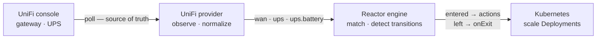

<picture>
  <source media="(prefers-color-scheme: dark)" srcset=".github/assets/banner-dark.svg">
  
</picture>

<p align="center">
  <a href="https://github.com/robbeverhelst/unifi-reactor/actions/workflows/test.yml"></a>
  <a href="https://github.com/robbeverhelst/unifi-reactor/releases"></a>
  <a href="https://github.com/robbeverhelst/unifi-reactor/pkgs/container/unifi-reactor"></a>
  <a href="LICENSE"></a>
</p>

<p align="center">
  <a href="#quickstart">Quickstart</a> ·
  <a href="#your-first-automation">First automation</a> ·
  <a href="#state-keys">State keys</a> ·
  <a href="#compatibility">Compatibility</a> ·
  <a href="#configuration">Configuration</a> ·
  <a href="docs/troubleshooting.md">Troubleshooting</a> ·
  <a href="docs/spec.md">Design spec</a>
</p>

---

Your WAN fails over to the 5G backup at 3am. Nothing in the cluster notices: qBittorrent keeps seeding, the nightly backup starts on schedule, and you find out when the data cap bill arrives. Or the power drops, the UPS starts counting down eighteen minutes of battery, and your cluster spends them transcoding video.

Your UniFi gear already knows all of this. **UniFi Reactor** is a Kubernetes operator that turns what it knows — which WAN is live, whether the UPS is on mains — into declarative actions on your cluster.

## Why this exists

- **State, not events** — Reactor polls the UniFi Network API and reconciles against what it observes. A dropped webhook, a network blip, or a controller restart can't strand your cluster in the wrong mode, because the next observation corrects it. Webhooks are an optimization, never the mechanism of record.
- **Reversal is explicit** — an automation says what to do when a condition starts holding, and separately what it wants once it stops. Nothing is inferred, undoing is never guessed, and every execution is recorded in the resource's status.
- **One workload, many automations** — a target's replica count is arbitrated across every automation pointing at it, not written by whichever one saw a transition last. Two automations can pause the same workload for unrelated reasons, and it stays paused until *neither* wants it down.
- **Safe by default** — a dedicated ServiceAccount with exactly the verbs it needs, no `cluster-admin`, no arbitrary shell execution, and credentials read from Kubernetes Secrets. Scaling is desired-state (`replicas = 0`), so retrying it is harmless; the actions that leave the cluster are refused until you say where they may go.
- **Boring to operate** — one static binary in a distroless image, no database, no queue, no UI. Small enough to forget about in a homelab.

## How it works



The engine knows nothing about UniFi. A provider converts vendor-specific reality into normalized state, and the engine reconciles your `Automation` resources against it. That seam is what lets other providers — a UPS over NUT, Proxmox, Prometheus alerts — arrive later without touching the core.

Observing `wan: backup` fifty times in a row does nothing fifty times. Scaling is a **desired state**, not a command: Reactor works out what every automation currently wants for a workload and reconciles it there, so the result depends only on which conditions hold — never on the order they were observed in.

## Quickstart

Create an API key in the UniFi UI under **Settings → Control Plane → Integrations**, then:

```sh
kubectl create namespace reactor-system

kubectl -n reactor-system create secret generic unifi-reactor-credentials \
  --from-literal=UNIFI_API_KEY=<your-api-key>

helm install reactor oci://ghcr.io/robbeverhelst/charts/reactor \
  --namespace reactor-system \
  --set unifi.url=https://192.168.1.1
```

Or without Helm, using the manifest bundle from the latest release:

```sh
kubectl apply -f https://github.com/robbeverhelst/unifi-reactor/releases/latest/download/install.yaml
```

Confirm it can see your hardware:

```sh
kubectl -n reactor-system logs deploy/reactor | grep 'state transition'
# INFO state transition provider=unifi key=ups from= to=online
# INFO state transition provider=unifi key=wan from= to=primary
```

The first observation reports every key it can see, so these lines are your inventory. For the full per-poll state, set `log.level=debug`.

## Your first automation

Pause downloads while the WAN is on the backup uplink, and resume them when it recovers — one resource covers both directions:

```yaml
apiVersion: reactor.robbeverhelst.com/v1alpha1
kind: Automation
metadata:
  name: pause-downloads-on-backup-wan
  namespace: media
spec:
  when:
    provider: unifi
    state:
      wan: backup

  actions:
    - type: kubernetes.scale
      target: { kind: Deployment, name: qbittorrent }
      replicas: 0

  onExit:
    - type: kubernetes.scale
      target: { kind: Deployment, name: qbittorrent }
      replicas: 1
```

```sh
kubectl -n media get automation
# NAME                           PROVIDER   MATCHING   SUSPENDED   READY   AGE
# pause-downloads-on-backup-wan  unifi      false      false       True    12s
```

Shedding load during a power cut is the same shape, matching `ups: on-battery` instead.

## When two automations share a workload

qBittorrent genuinely should pause for *both* a metered uplink and a power cut. Point both automations at it and nothing has to be coordinated by hand:

```sh
kubectl -n media get automation
# NAME                    PROVIDER   MATCHING   SUSPENDED   READY   AGE
# pause-on-backup-wan     unifi      false      false       True    3h
# shed-on-battery         unifi      true       false       True    3h
```

While *any* automation's condition holds, the workload stays at the **most restrictive** replica count asked for. The WAN recovering above does not bring qBittorrent back, because the UPS automation still wants it down — and the automation that lost says so plainly:

```sh
kubectl -n media get automation pause-on-backup-wan -o jsonpath='{.status.targets[0]}'
# {"ref":"Deployment/media/qbittorrent","desired":1,"effective":0,
#  "deferredBy":["media/shed-on-battery"]}
```

The workload comes back only once **no** automation wants it down.

### What "coming back" means

`onExit` declares the value an automation wants once nothing is holding the workload down. Omit it and Reactor restores the **baseline** — what the workload was set to before it first claimed it, recorded on the Deployment itself:

```sh
kubectl -n media get deploy qbittorrent -o jsonpath='{.metadata.annotations}'
# {"reactor.robbeverhelst.com/baseline-replicas":"1",
#  "reactor.robbeverhelst.com/claimed-by":"media/shed-on-battery",
#  "reactor.robbeverhelst.com/claimed-at":"2026-08-13T02:41:07Z"}
```

Those annotations are how a workload explains itself at 3am, and they are removed the moment nothing claims it — after which Reactor asserts nothing and you can scale it by hand freely.

| `spec.reversal` | What the automation wants once nothing claims the target | Default when |
| --- | --- | --- |
| `Declared` | the values in `onExit` | `onExit` is set |
| `Baseline` | whatever the target was before Reactor first claimed it | `onExit` is omitted |
| `None` | nothing — leave it wherever it was left | never; opt in explicitly |

> **Upgrading from v0.3.0:** an automation with no `onExit` used to leave its workload scaled down permanently. It now restores the baseline instead. Set `reversal: None` to keep the old behaviour.

> **GitOps:** Reactor writes `spec.replicas` and the three annotations above onto target Deployments. If Flux or Argo CD manages those Deployments it will report drift and revert them. Exclude the fields on any workload you let Reactor act on — Argo CD `ignoreDifferences` on `/spec/replicas` and the `reactor.robbeverhelst.com` annotations, or a Flux `patch` with the same exclusions.

### When an action fails

Each action is bounded by `timeoutSeconds` (default 30), so a target that has stopped answering fails and is retried rather than occupying the reconciler. Retries back off exponentially from 2s to a 1-minute cap and stop after five consecutive failures — at which point the automation says so and waits for the next state change instead of retrying forever:

```sh
kubectl -n media get automation pause-on-backup-wan -o jsonpath='{.status.conditions[?(@.type=="Applied")]}'
# {"type":"Applied","status":"False","reason":"RetryBudgetExhausted",
#  "message":"giving up after 5 attempts, will try again on the next state change: ..."}
```

`Ready` tells you whether an automation is healthy; `Applied` tells you whether what it wants is what its targets have. An automation that is outvoted by a more restrictive claim is `Ready=True, Applied=False` — working exactly as intended.

### Pausing an automation

`spec.suspend: true` takes an automation out of force without deleting it — during an incident, while testing, or when one is misbehaving:

```sh
kubectl -n media patch automation shed-on-battery --type=merge -p '{"spec":{"suspend":true}}'

kubectl -n media get automation
# NAME                    PROVIDER   MATCHING   SUSPENDED   READY   AGE
# pause-on-backup-wan     unifi      false      false       True    3h
# shed-on-battery         unifi      true       true        True    3h
```

**Suspending is a reversible delete, not a freeze.** A suspended automation keeps observing state and reporting `matching`, `observedState` and `lastTransition` — that is what makes it worth leaving in place while you debug — and stops claiming its targets entirely. Each target is arbitrated as if the automation were not there, so it goes back to whatever the other automations claiming it want, or to this one's [`reversal`](#what-coming-back-means) if none do. It reports `Ready=True`, `Applied=False` with reason `Suspended`.

Deletion gives the same answer, on purpose: "pause this" and "remove this" should not mean different things to a workload one of them is holding down. Two consequences worth knowing:

- **A suspended automation cannot strand a workload**, because it is not holding one. Deleting one is equally uneventful — its finalizer has nothing left to release.
- **It never fights you.** A suspended automation writes nothing. If it was the only claimant, Reactor's annotations come off the target as it lets go and you can scale that workload by hand; if another automation still claims it, that one is still in charge and `claimed-by` names it.

Resuming re-evaluates against current state and replays nothing: an automation whose condition still holds re-claims its targets on the next reconcile, recording a fresh baseline from whatever the workload is at then.

If what you wanted was "leave the workload exactly where it is", say that explicitly — with nothing else claiming the target, this pauses the automation *and* stops Reactor asserting a value for it:

```sh
kubectl -n media patch automation shed-on-battery --type=merge \
  -p '{"spec":{"suspend":true,"reversal":"None"}}'
```

### Removing an automation, or Reactor itself

Deleting an automation while it is holding a workload down hands the workload back rather than stranding it — a finalizer releases the claim first. Removing the policy removes its effect, even mid-outage, so an automation deleted while the UPS is still on battery brings its workload back up.

`helm uninstall` is the case worth understanding, because Helm does **not** delete the `Automation` CRD or your `Automation` resources. They survive the uninstall and simply stop reconciling. A pre-delete hook therefore releases every claim before the operator goes away, and removes the finalizers, which nothing would be left to service:

```sh
helm uninstall reactor -n reactor-system    # workloads return to their pre-Reactor values
helm uninstall reactor -n reactor-system --no-hooks    # skip it; workloads stay where they are
```

Set `uninstall.releaseClaims: false` to make that skip the default. Either way, every workload keeps its `baseline-replicas` annotation, so what it was before Reactor touched it is always recoverable by hand.

What is **not** covered: deleting the operator's Deployment directly, or losing the cluster. Reactor does not supervise its own absence — the annotations are the answer there. And if you ever delete an automation while the controller is down, its finalizer has nothing to release it:

```sh
kubectl patch automation <name> -n <namespace> \
  --type=merge -p '{"metadata":{"finalizers":[]}}'
```

## Telling you what happened

Everything above is invisible unless someone is reading controller logs — including the cases where Reactor deliberately did *nothing*, like holding state when the console went quiet. Two action types fix that by leaving the cluster: `notification.*` sends a message, `http.request` calls anything with an HTTP API.

Both are **edge actions**. They fire on this automation's own transitions and own nothing — unlike `kubernetes.scale`, which declares a level that is arbitrated across every automation sharing a target. An edge action in an `onExit` block still fires on this automation's own edge.

```yaml
apiVersion: reactor.robbeverhelst.com/v1alpha1
kind: Automation
metadata:
  name: pause-downloads-on-backup-wan
  namespace: media
spec:
  when:
    provider: unifi
    state:
      wan: backup

  actions:
    - type: kubernetes.scale
      target: {kind: Deployment, name: qbittorrent}
      replicas: 0
    - type: notification.ntfy
      notification:
        secretRef: {name: ntfy-credentials}
        title: "Reactor: {{ .Name }}"
        message: "{{ .Key }} moved from {{ .From }} to {{ .To }}; qbittorrent paused"

  onExit:
    - type: kubernetes.scale
      target: {kind: Deployment, name: qbittorrent}
      replicas: 1
    - type: notification.ntfy
      notification:
        secretRef: {name: ntfy-credentials}
        message: "{{ .Key }} back to {{ .To }}; qbittorrent resumed"
```

Transports shipped: `notification.ntfy`, `notification.discord`, `notification.slack`. Telegram is not shipped — its bot token lives in the URL path alongside a separate chat id, which does not fit the "the URL is the credential" shape the others share.

### Two things you have to set up first

**1. Allow the destination.** Outbound actions are refused by default and the allowlist is an install value, not something an automation can set:

```yaml
# values.yaml
actions:
  allowedDestinations:
    - https://ntfy.example.com
    - https://discord.com
```

This is the security boundary and it is worth understanding rather than pasting: anyone who can create an `Automation` in their own namespace can ask Reactor to make a request, and that request goes out from inside the cluster with the operator's network position rather than theirs. [SECURITY.md](SECURITY.md#outbound-actions-http-request-and-notification) has the reasoning and what is refused whatever you list.

**2. Put the destination in a Secret.** For every transport shipped, the webhook URL *is* the credential — so a notification has no URL field at all:

```sh
kubectl -n media create secret generic ntfy-credentials \
  --from-literal=url=https://ntfy.example.com/your-topic \
  --from-literal=authorization="Bearer tk_example"
```

| Secret key | Used for |
| --- | --- |
| `url` | the destination. Required for `notification.*`; for `http.request`, an alternative to `request.url` |
| `authorization` | sent as the `Authorization` header |
| `header-<Name>` | sent as the header `<Name>`, e.g. `header-X-Api-Key` |

The Secret must be in the automation's own namespace, and nothing from it is ever logged, put in status, or attached to an Event.

### Messages

`title`, `message` and `http.request`'s `body` are Go [`text/template`](https://pkg.go.dev/text/template) — the standard library, no Sprig:

| | |
| --- | --- |
| `.Automation` `.Namespace` `.Name` | who reacted |
| `.Provider` `.Matching` | which provider, and which direction the edge went |
| `.Key` `.From` `.To` | the transition that flipped `matching` |
| `.State` | every key this automation watches, e.g. `{{ .State.wan }}` |
| `.Time` | when the transition was observed, RFC 3339 |
| `json` | quotes a value for embedding in JSON: `{"wan": {{ json .To }}}` |

Only the message and the body are templated. The URL and the headers are literal on purpose — the destination is what the allowlist decided, and letting observed state edit it would hand back exactly the choice the allowlist exists to take away.

A key that does not exist is an error rather than the words `no value`, so a typo fails loudly at the moment the notification would have gone out. That covers `{{ .State.wan }}`; the `index` builtin (which you need for a dotted key, `{{ index .State "ups.battery" }}`) returns an empty string instead.

Values are treated as data, not structure, whatever they contain — which matters most for [`isp`](#state-keys), the one key whose values are an open set rather than an enum. Notification bodies are built with a JSON encoder rather than by string formatting, `json` is there so an `http.request` body can embed a value without hand-quoting it, and anything travelling in a header is reduced to printable ASCII.

### `http.request`

```yaml
- type: http.request
  request:
    method: POST                       # GET, POST, PUT or PATCH; defaults to POST
    url: https://example.com/hook      # or omit it and put url in the Secret
    secretRef: {name: hook-credentials}
    headers:
      - name: X-Reactor-Source
        value: homelab
    body: '{"automation": {{ json .Automation }}, "wan": {{ json .To }}}'
  timeoutSeconds: 10
```

### When a notification fails

**A failed notification never fails the automation.** The scale is the thing that had to happen; the notification is the report of it. So a failure is recorded in `status.edgeActions` and raised as a Warning `Event`, and `Ready` stays whatever the target reconciliation made it:

```sh
kubectl -n media get automation pause-downloads-on-backup-wan -o jsonpath='{.status.edgeActions}'
# [{"type":"notification.ntfy","status":"Failed","attempts":3,
#   "destination":"https://ntfy.example.com:443",
#   "reason":"https://ntfy.example.com:443: responded 502 Bad Gateway",...}]

kubectl -n media describe automation pause-downloads-on-backup-wan
# Warning  EdgeActionFailed  notification.ntfy was not delivered: ...
```

Ordering and delivery, stated plainly because they are choices rather than accidents:

- **The scale happens first.** A transition whose target could not be written is not committed, so nothing announces a workload was paused while it is still running. It is announced on the retry that succeeds.
- **At most once per transition.** The transition is written to status *before* anything is sent, so a failed or conflicting status write cannot send the same message twice. Nothing is re-sent on a later reconcile — that reconcile has no new transition, so a re-send would be a duplicate, not a retry.
- **Retries happen inside the one reconcile.** A notification is a publish, so it is tried three times against a timeout, a 5xx or a 429. `http.request` is not: `GET` and `PUT` retry ([RFC 9110](https://www.rfc-editor.org/rfc/rfc9110#name-idempotent-methods) calls them idempotent), and `POST` and `PATCH` are attempted exactly once unless you set `request.idempotent: true`. Reactor cannot tell your webhook from your order API, and a duplicate side effect is worse than a missed one when nobody knows what the side effect is.
- **A suspended automation sends nothing**, the same way a deleted one does not. Suspending is a reversible delete.
- **Nothing fires on deletion.** Deleting an automation is not a state transition, and a "WAN recovered" message caused by a `kubectl delete` would be a lie.

## State keys

Each key is published only when the matching hardware is adopted by your controller.

| Key | Values | Meaning |
| --- | --- | --- |
| `wan` | `primary`, `backup` | which uplink the gateway is currently using |
| `isp` | a slug, e.g. `telenet`, or `unknown` | the carrier behind the live uplink |
| `ups` | `online`, `on-battery` | whether a UniFi UPS is on mains or running on battery |
| `ups.battery` | `normal`, `low`, `critical` | remaining charge against the configured thresholds |

`isp` is the one key whose values are not a closed set: it is the carrier name your console geolocated your public address to, lowercased with everything non-alphanumeric turned into a hyphen. Look it up before matching on it —

```sh
kubectl -n reactor-system logs deploy/reactor | grep 'key=isp'
# INFO state transition provider=unifi key=isp from= to=telenet
```

— and use it when *who* is carrying your traffic is what matters rather than which port it leaves by, which is usually the case for anything metered:

```yaml
  when:
    provider: unifi
    state:
      isp: unknown        # or your backup carrier's slug
```

It exists for a second reason. `wan` and `isp` are independent answers to "did the uplink change", so Reactor compares them: if one moves and the other does not, it says so rather than quietly trusting either. Those lines are worth reading — see [`wan` and `isp` disagree](docs/troubleshooting.md#10-wan-and-isp-disagree-about-a-failover).

`ups` and `ups.battery` are separate on purpose. An automation matching `ups: on-battery` stays matched for the whole outage as the battery drains — with a single escalating enum, dropping from `on-battery` to `low-battery` would leave the matching state and fire `onExit`, scaling workloads back **up** in the middle of a power failure. Express escalation by matching both keys instead; all keys in a `state` block must match.

```yaml
  when:
    provider: unifi
    state:
      ups: on-battery
      ups.battery: critical
```

If a provider stops reporting a key at all — the hardware dropped off the controller — Reactor holds the last known state and reports `Ready=False` with `StateKeyUnavailable` rather than treating lost visibility as a condition that ended ([what to do about it](docs/troubleshooting.md#2-statekeyunavailable-and-held-state)).

### Settling a noisy signal

A changed value can be required to hold for several consecutive observations before Reactor acts on it, which stops one flapping signal driving repeated actions:

```yaml
unifi:
  debounce:
    default: 1          # react on the first observation
    keys:
      ups.battery: 2    # ...but let a threshold crossing settle
      isp: 2            # ...and let a re-geolocated carrier settle
```

Each extra sample costs one `pollInterval` of reaction time, so the default is `1`: a WAN failover and a power cut both deserve an immediate reaction, and neither flaps. `ups.battery` ships at `2` because it is a threshold crossing — a charge hovering at 30% would otherwise report `low`, `normal`, `low` — and because a battery drains over minutes, so spending one more poll to be sure costs nothing. At the default 30s poll that makes a battery-level escalation react in 60s worst case instead of 30s.

`isp` ships at `2` for a different reason: it is not a link state but the result of a geolocation lookup on whatever public address the gateway currently holds, so it can report `unknown` for a poll or two while a new address is being resolved — precisely during the failover you would be reacting to. One extra sample skips that window. Nothing else needs it: `wan` and `ups` are switch positions, and they do not flap.

Debouncing happens in the shared state store, so every automation sees the same settled value. Two automations can never disagree about the current state and fight over a workload they share.

## Knowing it is working

Reactor's worst failure is **silent and fails open**. If it stops observing — an expired API key, a rebooted console, a network partition — every automation quietly stops reacting. Nothing in the cluster notices, and the next real outage simply does not get handled. There is no error to find, because nothing errored.

One metric answers that, and it is the reason the rest exist:

```promql
time() - reactor_last_observation_timestamp_seconds
```

Metrics are **off by default** and register on the endpoint controller-runtime already serves — there is no second server and no second auth posture:

```sh
helm upgrade reactor ... \
  --set metrics.enabled=true \
  --set metrics.serviceMonitor.enabled=true \
  --set metrics.rules.enabled=true \
  --set metrics.dashboard.enabled=true
```

| Metric | Type | Answers |
| --- | --- | --- |
| `reactor_last_observation_timestamp_seconds` | gauge | is Reactor still seeing anything |
| `reactor_observations_total` | counter | how often polling succeeds and fails |
| `reactor_state_info` | gauge 0/1 | what each state key holds right now |
| `reactor_state_transitions_total` | counter | how often failover actually happens |
| `reactor_automation_matching` / `_ready` | gauge 0/1 | which policies are in force, and which are broken |
| `reactor_arbitrations_total` | counter | claimed, deferred to a peer, or released |
| `reactor_actions_total` | counter | action outcomes, by type and **kind** |
| `reactor_action_duration_seconds` | histogram | slow or hanging actions |
| `reactor_reaction_latency_seconds` | histogram | observation → action, end to end |
| `reactor_webhook_deliveries_total` | counter | fast-path deliveries accepted, coalesced, refused |
| `reactor_provider_signal_disagreements_total` | counter | two independent signals for one fact disagreeing |

Reconcile counts, queue depth and reconcile latency are controller-runtime's own `controller_runtime_*` series on the same endpoint. Reactor does not reimplement them. It also deliberately **does not re-export UniFi telemetry** — a UniFi exporter covers that better, and Reactor's unique vantage point is the decision layer.

`kind` on `reactor_actions_total` is `desired_state` or `edge`, and no alert should be written without it. A failed `kubernetes.scale` means the cluster is not in the state you asked for. A failed notification means nobody was told — [the workload was still scaled](#when-a-notification-fails), and the automation is still `Ready`. The shipped rules alert on those separately for exactly that reason.

### Cardinality, on purpose

`isp` is the first state key whose values are an **open set** — a carrier slug derived from whatever public address your gateway currently holds. So `reactor_state_info` is published only for keys whose provider declares a closed value set, and `isp` is deliberately not one of them. The transition counter is not labelled by `from`/`to` for the same reason. What a key currently holds is always in `status.observedState` and in an `Event`; what Prometheus keeps is bounded at compile time.

Declaring the vocabulary is also what lets the gauge report `0` for the values a key does *not* hold. Without that, the series for a value it used to hold goes stale at `1` rather than dropping, and every graph built on it lies. All values `0` means the key is not currently observable — the metric side of [`StateKeyUnavailable`](docs/troubleshooting.md#2-statekeyunavailable-and-held-state).

### Alerts and the dashboard

`metrics.rules.enabled` ships a `PrometheusRule` — `ReactorObservationStale` first, then failing observations, failing actions, edge actions failing separately, automations stuck not-ready, and reactions getting slow. `ReactorUPSOnBattery` and `ReactorWANOnBackup` are informational: they let your existing alerting learn what your network already knows.

`metrics.dashboard.enabled` ships a grafana-operator `GrafanaDashboard`. It pins no datasource — you pick one from a variable when you open it — so the same JSON works in any Grafana, and it is a plain file at [`charts/reactor/dashboards/reactor.json`](charts/reactor/dashboards/reactor.json) if you would rather import it by hand.

Both need their operator's CRDs, and both refuse to render without `metrics.enabled` rather than quietly querying series nothing is publishing.

## Compatibility

Everything here was built against one setup, and this table says which one. "Verified" means a real capture or a real cluster; "expected" means the code path is version-independent as far as anyone can tell, which is not the same thing.

| | Verified | Expected to work | Known not to work |
| --- | --- | --- | --- |
| UniFi Network | 10.5.67 | 10.x | — |
| Console | UDM Pro (gateway firmware 5.1.26) | UDM/UDM SE/UDR/UXG, Cloud Key with a gateway adopted | a site with no gateway and no UniFi UPS: nothing to observe |
| UPS | UniFi UPS 2U (`USWDA26`, firmware 1.6.1) | any UniFi UPS reporting `vbms_table` | third-party UPS over NUT — a separate provider, not this one |
| Kubernetes | CI: envtest 1.36 API server, and the current kind default node image for e2e | 1.25+ — only long-stable APIs are used (`apps/v1` scale, `policy/v1`, `apiextensions/v1`, leases) | — |
| Helm | 3.x | — | — |

Reactor asks the console what it is running and says so at startup:

```sh
kubectl -n reactor-system logs deploy/reactor | grep -E 'version detected|tested against'
# INFO UniFi Network version detected version=10.5.67 verifiedAgainst=10.5.67 verifiedConsole="UDM Pro"
# INFO Kubernetes version detected version=v1.34.1
```

Outside the range above it warns and **carries on**. Refusing to start against a console that would have worked fine is a worse failure than a log line, and most of them will work fine — the warning exists so that a missing state key reads as an incompatibility rather than as a configuration mistake. If your console is not in the table and it works, [say so](https://github.com/robbeverhelst/unifi-reactor/issues/new/choose): every row here started as somebody's report.

State keys degrade one at a time, so a console with no UniFi UPS still reports `wan` and `isp`, and a gateway whose fields have moved still reports `ups`. Only observing nothing at all is an error.

## Configuration

Chart values ([full reference](charts/reactor/README.md)):

| Value | Default | Description |
| --- | --- | --- |
| `crds.install` | `true` | install and upgrade the `Automation` CRD with the release |
| `unifi.url` | — | UniFi console base URL; the provider stays disabled until this is set |
| `unifi.site` | `default` | UniFi Network site |
| `unifi.pollInterval` | `30s` | how often WAN and UPS state are observed |
| `unifi.insecureSkipVerify` | `true` | accept the console's self-signed certificate |
| `unifi.existingSecret` | `unifi-reactor-credentials` | Secret holding `UNIFI_API_KEY`; re-read on every poll, so rotating the key needs no restart |
| `log.level` | `info` | `debug` adds the per-observation lines used to work out why an automation did not fire |
| `unifi.ups.lowBatteryPercent` | `30` | charge at or below this reports `ups.battery: low` |
| `unifi.ups.criticalBatteryPercent` | `10` | charge at or below this reports `ups.battery: critical` |
| `unifi.webhook.enabled` | `false` | webhook fast path (below) |
| `actions.allowedDestinations` | `[]` | where outbound actions may go. Empty refuses all of them, and withholds the operator's read access to Secrets ([why](#telling-you-what-happened)) |
| `metrics.enabled` | `false` | serve `/metrics` on `:8443` over HTTPS behind the API server's authn/authz filter ([above](#knowing-it-is-working)) |
| `metrics.serviceMonitor.enabled` | `false` | scrape it with the Prometheus Operator |
| `metrics.rules.enabled` | `false` | ship the alert rules, `ReactorObservationStale` first |
| `metrics.dashboard.enabled` | `false` | ship the overview dashboard as a grafana-operator `GrafanaDashboard` |
| `rbac.clusterWide` | `true` | when `false`, restricts the operator to its own namespace |

`Automation` resources are namespaced. An action targets its own namespace by default; naming a different one in `target.namespace` requires `rbac.clusterWide: true`.

### Webhook fast path

Reactions are normally no faster than `unifi.pollInterval`. UniFi's Alarm Manager can post to Reactor instead, cutting that to about a second — and Reactor can create that Alarm Manager rule itself, rather than asking you to click through the UniFi UI.

It is off by default and stays an optimization. A delivery **triggers a poll**; it never sets state. Its payload is not parsed at all, so a delivery that is dropped, duplicated, replayed or forged costs at most one extra request to your console. Every delivery must present a shared secret, the receiver is not exposed outside the cluster unless you expose it, and self-registration fails soft — if the console does not behave as expected, Reactor logs why and carries on polling.

See the [chart reference](charts/reactor/README.md#webhook-fast-path-optional-off-by-default) for the values, how to make the receiver reachable from your console, and what is worth knowing before turning self-registration on.

## Documentation

- [Troubleshooting](docs/troubleshooting.md) — nothing is happening, `StateKeyUnavailable`, credentials, CRD upgrades, RBAC, stranded workloads
- [Adding a provider](docs/adding-a-provider.md) — the `Observe` contract, the state vocabulary, and the capture policy, walked through the UniFi provider
- [Design spec](docs/spec.md) — the architecture, the state-first rationale, and the roadmap in full
- [Chart reference](charts/reactor/README.md) — every value, both RBAC modes
- [Captured UniFi payloads](testdata/unifi/README.md) — the real API responses every parser is written and tested against
- [UniFi Alarm Manager API](docs/unifi-alarm-manager-api.md) — reverse-engineered notes on configuring UniFi's outbound webhooks programmatically
- [Development](docs/development.md) — building, testing, and running against a local cluster
- [Contributing](CONTRIBUTING.md) — the dev loop, conventional commits, and the fixture capture policy
- [Security policy](SECURITY.md) — the outbound-action threat model, how to report a vulnerability, and how to verify a signed release

## Stability

Early days: the API group is `v1alpha1` and the project is pre-1.0, so expect breaking changes between minor versions.

**`spec.trigger` — the event-shaped trigger kind — has been removed from `v1alpha1`.** Up to v0.3.0 the CRD accepted it, CEL-validated it, and then ignored it: no version of the engine has ever processed an event trigger. A v1 whose API accepts configuration it silently drops is worse than one that does not offer the field at all, so it is gone until it is real. Two things had to exist before it could come back, and one of them now does:

- **an action that expresses an occurrence** — *met.* `http.request` and `notification.*` are edge actions: they fire on a transition rather than declaring a level, so an event trigger now has something to run.
- **a captured delivery to match against** — *still missing, and the blocker.* `trigger.match` matched on payload fields, and no UniFi Alarm Manager payload has ever been captured — [`testdata/unifi/webhooks/`](testdata/unifi/README.md) is empty, and the webhook fast path deliberately never reads a delivery body. Parsers here are written against real captures, never against an assumed shape, and an event matcher is a parser.

The two-kind split itself is unchanged and still the design. `when` is what that promise protects: nothing with an observable current value will be re-modelled as an event, and no state automation has to migrate when `trigger` returns in `v1alpha2` with the shape it always had.

> **Upgrading from v0.3.0:** an Automation using `spec.trigger` can no longer be created or updated, and `spec.when` is now required. Existing ones survive in etcd — Helm never deletes your resources — and keep doing what they always did, which is nothing. Reactor names them in its log and in an Event on the resource; `kubectl delete` them.

**The name stays `unifi-reactor` through v1**, and adding providers does not change that. The user-facing surface is already provider-neutral — the API group is `reactor.robbeverhelst.com`, the kind is `Automation` with a `provider` field, the chart is `reactor`, the namespace is `reactor-system` — so a NUT, Proxmox, or Prometheus provider lands with no breaking change and nothing to migrate. Only the repository, the Go module path, and the image carry the `unifi-` prefix, and those are the surfaces you touch least. Discovery favours the specific name besides: people search for a UniFi Kubernetes operator, and `reactor` alone has a lot of prior art. If a second provider ever gains real users, renaming is a repository rename (GitHub redirects), a transition period publishing the image under both paths, and a major-version bump of the module path — a decision for when it has users, not for a version boundary on its own.

Parsers are written against real captured API responses committed to [`testdata/`](testdata/unifi/), never against assumed formats. Two caveats worth stating plainly.

**A genuine WAN failover has still never been observed** ([#34](https://github.com/robbeverhelst/unifi-reactor/issues/34)). `wan` is derived from which port reports `is_uplink`, inferred from one capture in which only one uplink was live — so whether `is_uplink` follows the traffic or just marks the port configured as primary is unconfirmed. What has changed is that the guess is no longer silent or alone: the gateway's own uplink interface is used as a second opinion where `is_uplink` names no single live port, `isp` (from #6) is compared against `wan` across observations, and any disagreement between them is logged rather than resolved. The provider is exercised against five different hypotheses about what a failover looks like, in tests and in `make dev-mock`, and it reports something defensible under all of them. That is not the same as knowing. Treat `wan` as less battle-tested than `ups`, watch for the [disagreement warnings](docs/troubleshooting.md#10-wan-and-isp-disagree-about-a-failover), and if you have a gateway with two working uplinks, the [capture runbook](testdata/unifi/README.md#capturing-a-real-failover) is fifteen minutes that would close this.

And the webhook fast path has been exercised against the mock console, not a real one — which is a large part of why it defaults off and why nothing depends on it being right.

## Roadmap

- Event triggers for genuinely point-in-time things, like a client connecting — returning as `spec.trigger` in `v1alpha2`, once a real delivery payload has been captured and there is an edge action to run ([why it is not in `v1alpha1`](#stability))
- More actions: `restart`, CronJob suspend, and the UniFi write actions
- Richer status conditions, and debounce made visible in status rather than only in the log
- More providers, driven by demand: NUT, Proxmox, Prometheus alerts, Home Assistant

Non-goals: replacing UniFi Network or UniFi OS, becoming a general-purpose workflow engine like n8n or Argo Workflows, replacing Home Assistant, or executing arbitrary shell commands.

## Contributing

PRs welcome — [CONTRIBUTING.md](CONTRIBUTING.md) has the full version, including the fixture capture policy, which is a genuinely unusual rule and not one you would guess. The short version:

```sh
make test          # unit + envtest
make lint          # golangci-lint
make dev-deploy DEV_CONTEXT=<your-cluster> UNIFI_URL=... UNIFI_API_KEY=...
```

No UniFi hardware needed — `make dev-mock` serves the captured payloads and rehearses a WAN failover or a power outage on demand. Conventional commits; tagging `vX.Y.Z` builds and publishes the multi-arch image, the OCI chart, and `install.yaml` from CI, with [generated release notes standing in for a changelog](CHANGELOG.md).

Bug reports go through the [issue templates](https://github.com/robbeverhelst/unifi-reactor/issues/new/choose), which ask for the four things that make a report reproducible. Participation is covered by the [Code of Conduct](CODE_OF_CONDUCT.md).

## License

[Apache 2.0](LICENSE)
